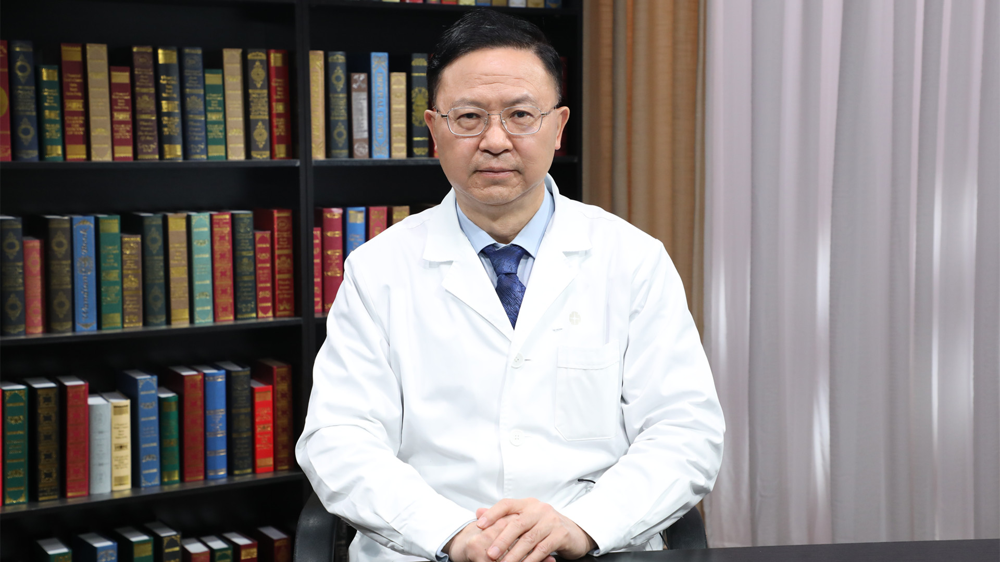

# 11.26 肝癌//卢实春教授

---

## 卢实春 主任医师

中国人民解放军总医院第一医学中心肝胆胰外科学部学术主任 主任医师 博士生导师。

中华预防医学会肝胆胰疾病防控专业委员会主任委员；中华医学会器官移植学分会肝移植学组 外科学分会肝移植学组委员；北京医学会器官移植学分会副主任委员；全军器官移植学专业委员会常务委员；中国医师协会器官移植医师分会专业委员会常务委员。

**主要成就：** 获得省市级科研成果奖3项，主持国家级省部级以上课题10余项；发表相关论文170余篇，含在Science、Cell stem cells、Hepatology、Journal for ImmunoTherapy of Cancer（JITC）等杂志发表SCI论文近50篇。

**专业特长**  **：** 擅长肝胆胰良恶性疾病外科治疗、终末期肝胆病以及急性肝功能衰竭肝移植，累计参与完成各种肝移植逾千例，其他肝胆胰大型手术五千余例。主要研究方向为肝胆外科疾病、精准医学、肝再生医学、移植学及移植免疫。

---
