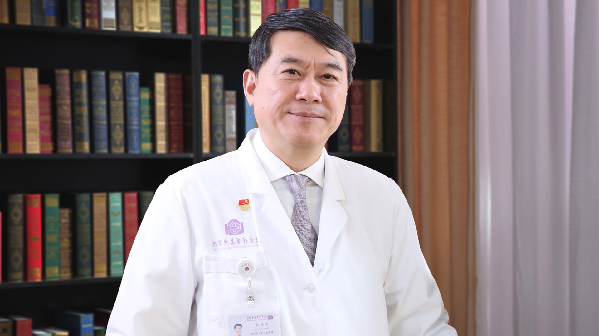

# 11.27 肝癌

---

## 董家鸿 院士

中国工程院院士 清华大学附属北京清华长庚医院院长 主任医师。

清华大学临床医学院院长 清华大学教授；清华大学精准医学研究院院长；中国医师协会常务副会长；国际著名肝胆外科专家和肝脏移植专家。

**主要成就：** 以第一完成人获国家科技进步二等奖1项和省部级一等奖3项，以合作完成人获国家科技进步一等奖1项；以第一作者或通讯作者发表SCI论文100余篇，主持制订11部行业指南，主编出版专著5部，主持国家科技支撑计划等项目20项；在国际上首次提出“精准外科”新理念，创立了精准肝胆外科范式。这一理念已被广泛应用于胰腺外科、神经外科、脊柱外科、整形外科、介入治疗科等诸多临床专科领域，促进了当代外科理念和范式的革新。

**专业特长：** 创立并践行精准医疗、精益管理、精诚服务的“三精医疗”理念，在北京清华长庚医院建立起具有鲜明特色的现代医院管理体系。

---
