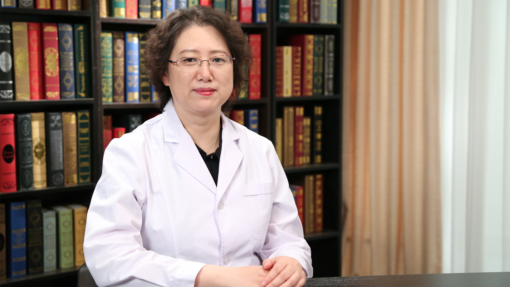

# 11.29 肝癌射频消融治疗

---

## 严昆 主任医师

北京大学肿瘤医院（北京肿瘤医院）超声科主任 主任医师 博士生导师。

中华医学会超声分会常务委员；中国超声医学工程学会副会长；海峡两岸医药卫生交流协会超声医学专业委员会副主任委员；北京医学会超声医学分会副主任委员。

**主要成就：** 近年以第一作者及责任作者发表论文51篇，其中SCI论文13篇；主持国家及省部级科研课题3项；《介入微创治疗肝癌的临床与基础研究》获中国人民解放军医疗成果奖二等；《肝癌射频消融规范化治疗方案及治疗策略研究》获北京市科学技术进步二等奖；《超声造影在肝癌早期诊断应用研究》获北京市科学技术进步二等奖。

**专业特长：** 擅长肝脏病变的诊断和肝癌早期诊断，肝脏恶性占位的射频消融治疗，超声引导下穿刺活检，胰腺、肺胸、甲状腺等疾病的诊断，超声微泡增敏肿瘤化疗等。

---
