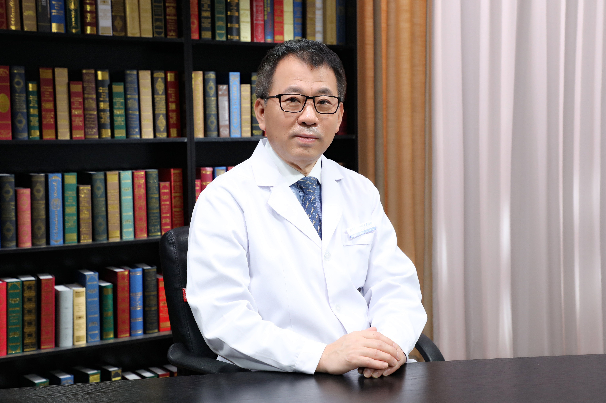

# 11.39 骨肿瘤

---

## 牛晓辉 主任医师

北京积水潭医院骨肿瘤科主任 主任医师 教授 博士生导师。

北京积水潭医院骨与软组织肿瘤诊疗研究中心主任；中华医学会骨科学分会骨肿瘤专业组副组长；中国医师协会骨科医师分会骨肿瘤专业组副组长；中国临床肿瘤学会肉瘤专家委员会主任委员；中国临床肿瘤学会理事；中国抗癌协会理事；国际保肢协会常务理事；《中华外科杂志》《中华骨科杂志》《山东医药》等期刊编委 《中国骨与关节杂志》副总编辑。

**主要成就：** 主持骨与软组织肿瘤数据库的建立项目并建立世界上第一个原发骨肿瘤流行病学在线数据库；主持国家自然科学基金，首都医学发展基金等多项课题；以第一作者或通讯作者发表论文200余篇，参与编写专著10余部，主编《计算机导航辅助骨肿瘤外科手术学》《骨肿瘤标准化手术》《软组织肿瘤标准化手术》《骨科专家病例解析丛书•骨肿瘤》《积水潭骨与软组织肿瘤病例精粹:多学科综合讨论》等；作为编写组长在我国推出《CSCO经典型骨肉瘤诊疗指南》（2018和2020）、《CSCO软组织肉瘤诊疗指南》（2019和2021）、《CSCO骨巨细胞瘤诊疗指南》共3部行业指南。

**专业擅长：** 擅长骨与软组织肿瘤的临床、基础研究及教育工作，在四肢恶性骨及软组织肿瘤的保留肢体治疗、骨肉瘤的综合治疗、骨盆肿瘤的外科治疗、脊柱肿瘤及骶骨瘤的诊断与治疗、计算机导航辅助骨肿瘤外科手术、恶性肿瘤的外科边界研究、骨肉瘤肺转移的二线治疗等方面均处于国内领先、甚至国际先进水平。

---
