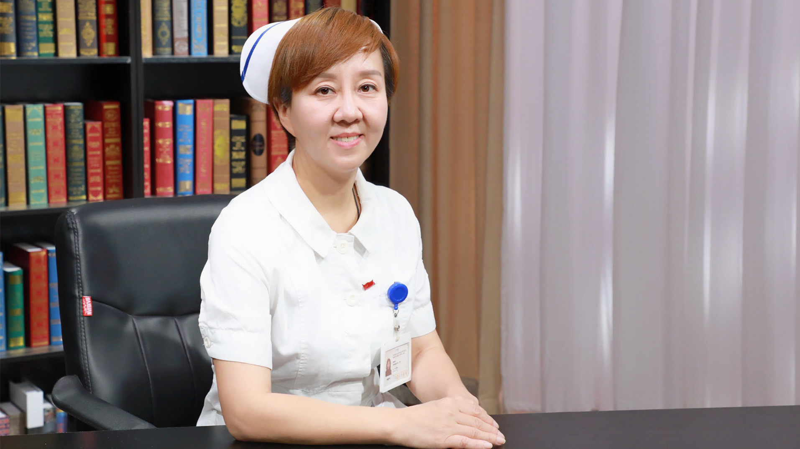

# 11.42 喉癌的护理

---

## 刘永玲 副主任护师

首都医科大学附属北京同仁医院耳鼻喉科护士长。

中国抗癌协会头颈肿瘤专业委员会护理学组副组长；刘永玲喉癌康复护理工作室领军人物；《中华现代护理杂志》审稿专家。

**主要成就：** 承担北京护士学校耳鼻喉专业课程授课任务9年；以第一作者在核心期刊上发表论文11篇；承担院内耳鼻喉护理科研课题二项，参编书籍多部；承担国家级继续医学教育项目的申报和组织管理工作。

**专业特长：** 从事耳鼻咽喉头颈外科临床护理工作25年，擅长耳科、鼻科、咽喉科、头颈外科常见疾病的护理；积极开展喉癌康复管理延伸护理服务，在喉癌的日常护理、功能锻炼、伤口管理等方面深入开展工作。

---
