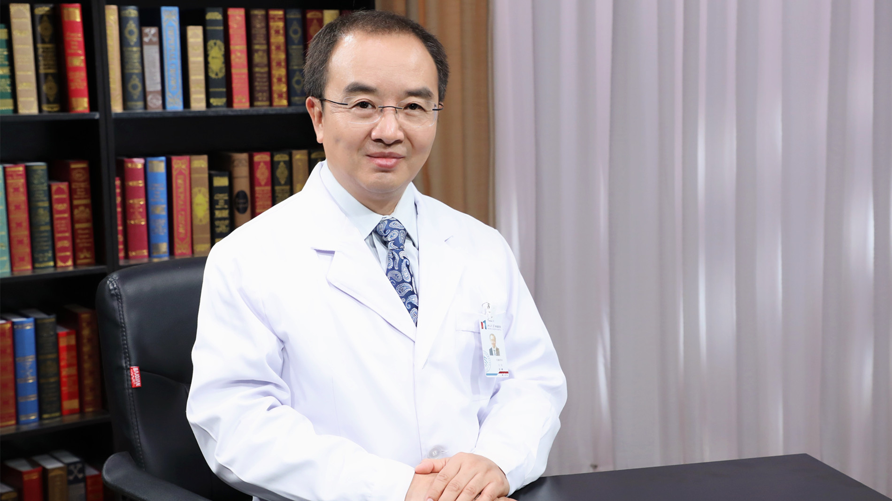

# 11.45 甲状腺癌

---

## 张彬 主任医师

北京大学肿瘤医院头颈外科主任 主任医师  医学博士 博士生导师。

中国医师协会肿瘤分会头颈肿瘤专委会主委 ；中国临床肿瘤学会(CSCO)头颈肿瘤专委会副主委；中国抗癌协会头颈肿瘤专委会常委兼青年委员会主委 ；美国头颈外科协会(AHNS)通讯会员 ；北京市抗癌协会甲状腺癌专业委员会主委；《中华耳鼻咽喉头颈外科杂志》编委。

**主要成就：** 发表论文95余篇，其中SCI收录15余篇；获得中华医学会奖三等奖；科研课题10余项，其中国家自然科学基金1项；2012-2018年被评为中国名医百强榜头颈外科和甲状腺外科Top10医生。

**专业特长：** 擅长甲状腺癌、喉癌、下咽癌、口腔癌、腮腺肿瘤、颌骨肿瘤、鼻腔癌、上颌窦癌、面部皮肤癌及其他头颈部软组织等肿瘤的外科治疗，特别是复发甲状腺癌的再次手术、达芬奇机器人甲状腺及口咽癌“无痕”和微创手术等。

---
