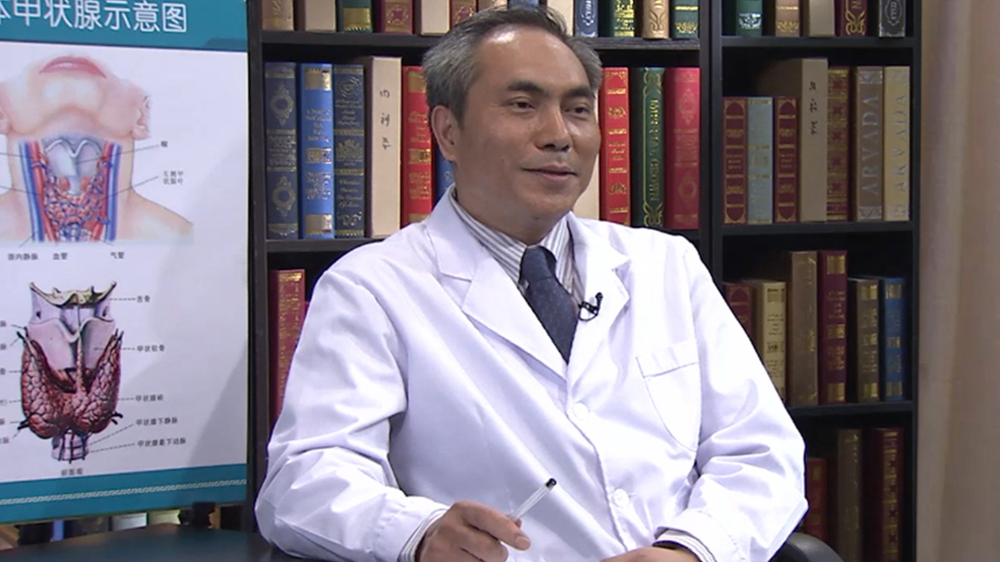

# 11.46 甲状腺肿瘤

---

## 刘绍严 主任医师

中国医学科学院肿瘤医院头颈外科副主任 主任医师 医学博士 教授 研究生导师。

中国医师协会耳鼻咽喉科医师分会头颈组副组长；中国抗癌协会头颈肿瘤学人才培养及科研基金副主委；中国医疗保健国际交流促进会常务理事；海峡两岸医药卫生交流协会肿瘤防治委员会常务委员；《国际耳鼻咽喉头颈外科杂志》《中国耳鼻咽喉头颈外科杂志》《中国医学文摘耳鼻咽喉科学杂志》编委。

**专业特长：** 擅长于喉癌；下咽癌；鼻侧副鼻窦癌；腮腺肿瘤；气管肿瘤等头颈肿瘤外科诊治。颈段食管癌外科治疗；中颅底手术；口腔颌面外科手术；甲状腺疾病外科治疗；晚期甲状腺癌救治；头颈部修复。

---
