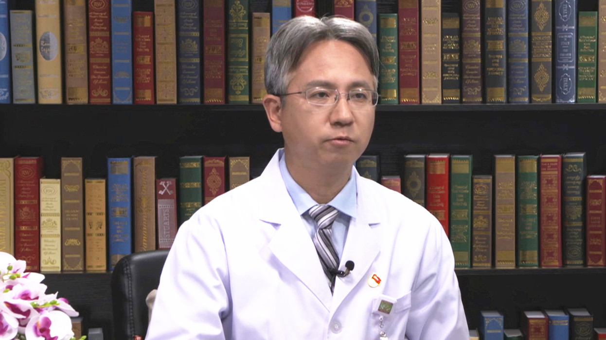

# 11.59 肝癌的介入治疗

---

## 李晓光 主任医师

北京医院肿瘤微创治疗中心科主任 主任医师 博士生导师。

世界华人肿瘤医师协会副主任委员；中国研究型医院学会肿瘤介入专业委员会副主任委员；中国抗癌协会肿瘤微创治疗专业委员会常委；中华医学会放射学分会介入学组青年委员 ；中国医师协会微无创医学专业委员会第一届肿瘤学专业委员会副主任委员；国家肿瘤微创治疗产业技术创新战略联盟专业委员会常委。

**主要成就：** 发表论文共95篇，其中SCI论文12篇，总IF=22.96，参编学术专著12部；系列研究获得北京协和医院医疗成果奖一等奖，中华医学科技奖三等奖；主持并参与多项国家级和省部级科研课题；发明创造专利：一种用于囊性癌肿瘤消融的微波天线 专利号：201510115456.7。

**专业特长：** 致力于介入放射学研究，擅长全身各部位血管病变和实体性肿瘤的影像诊断和微创介入治疗。在国内率先开展经桡动脉途径进行外周血管内介入诊疗，CT引导下经皮穿刺射频/微波消融治疗肝、肺、胆道肿瘤以及各部位病变的穿刺活检技术和食道、胆道、气道、消化道支架置入术，呼吸道、消化道出血的栓塞止血技术。

---
