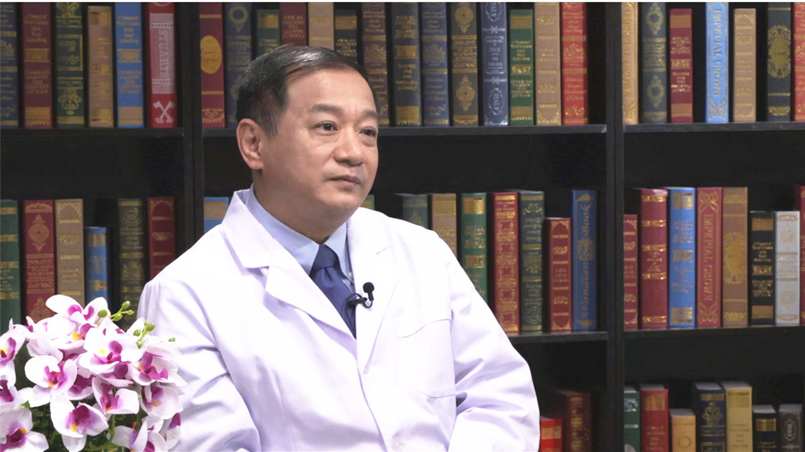

# 11.64 腹膜后肿瘤

---

## 郝纯毅 主任医师

北京大学肿瘤医院国际合作部主任 大外科常务副主任。

肝胆胰外科主任 腹膜后肿瘤中心主任；国际外科 消化道和肿瘤科医师协会（IASGO）副秘书长；中国临床肿瘤学会胰腺癌专家委员会主任委员；中国医学促进会软组织肿瘤分会主任委员；中国医学促进会肝脏专家委员会秘书长；中华医学会外科学分会胰腺外科学组委员；中国临床肿瘤学会常务理事。

**主要成就：** 享受国务院特殊津贴专家；北京市“十百千”卫生优秀人才；北京市“215人才工程”学科带头人；北京市“高创计划”卫生领军人才；北京市医管局“登峰”人才计划；主持多项国家级课题，发表中英文论文70余篇。

**专家特长：** 致力于肝胆胰腺肿瘤的诊断、治疗和转化医学研究二十五年；创建了国内首个软组织与腹膜后肿瘤中心，在肝胆胰腺肿瘤、腹膜后肿瘤的诊治方面积累了丰富的经验。

---
