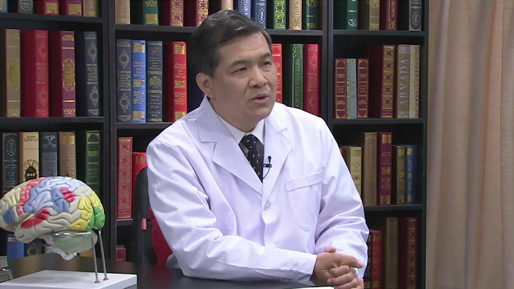

# 11.66 脑胶质瘤

---

## 李文斌 主任医师

首都医科大学附属北京天坛医院 神经肿瘤综合科主任 博士研究生导师。

首都医科大学肿瘤学系副主任；中国抗癌协会脑胶质瘤专委会副主委兼秘书长；中国药促会药物临床研究专委会副主委；中国医师协会脑胶质瘤专委会常委。

**主要成就：** 主译巜脑胶质瘤生物学》主编巜医学博士英语考试综合应试指南》等；发表学术论文50余篇，其中SCI刊物10余篇。

**专业特长：** 擅长脑胶质瘤及中枢神经系统恶性肿瘤的综合诊疗，脑胶质瘤的临床药物试验研究。

---
