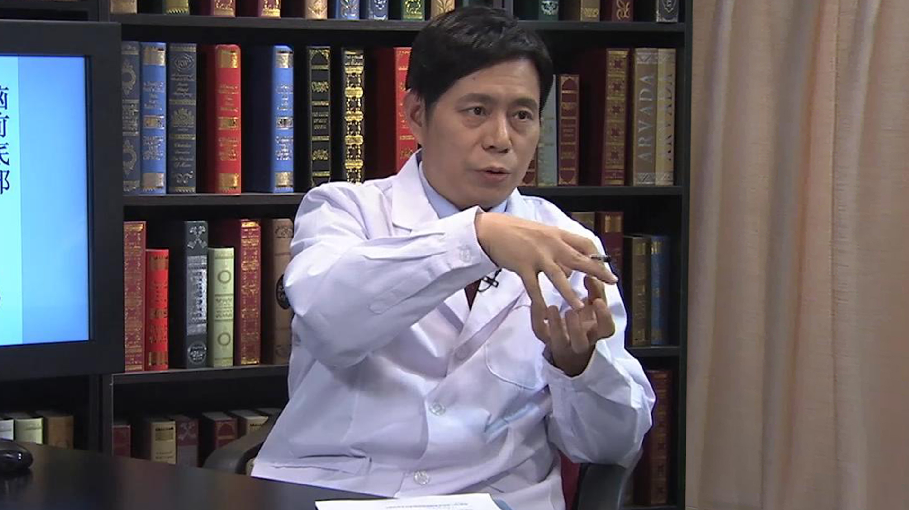

# 11.68 脑膜瘤

---

## 万经海 主任医师

中国医学科学院肿瘤医院神经外科主任 主任医师 教授 博士生导师。

中国医师协会神经内镜专业委员会委员；中国抗癌协会神经肿瘤专业委员会委员；中国抗癌协会微创治疗专业委员会常委；中国颅底外科多学科协作组委员；第三届中央保健委员会专家。

**主要成就：** 主持完成的“前侧方颅底手术入路临床应用研究”获2002年度省部级科学技术进步二等奖；主编国内第一部脑膜瘤专著《脑膜瘤》《国家癌症中心肿瘤专家答疑丛书•应对脑瘤专家谈》；参加编写《微创神经外科学》等大型专著10部；发表有关脑肿瘤、脊髓肿瘤临床研究SCI及核心期刊论文70篇。

---
