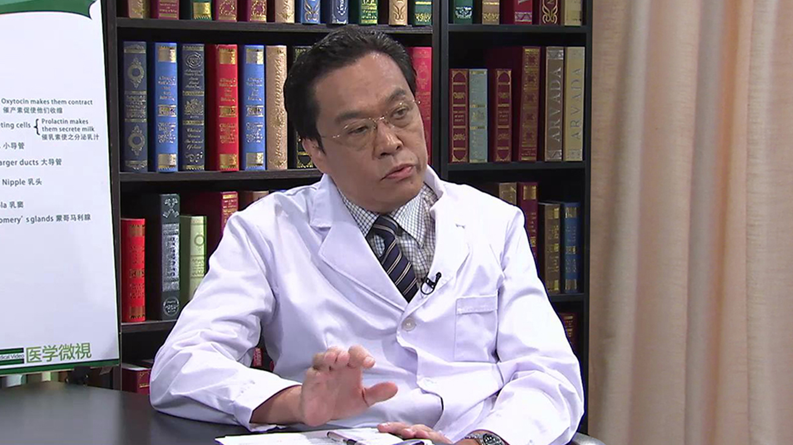

# 11.77 乳腺癌//李金锋教授

---

## 李金锋 主任医师

北京大学肿瘤医院乳腺中心副主任 主任医师 医学博士 教授。

中国抗癌协会乳腺癌专业委员会委员；国家自然科学基金评审委员会委员；北京市科委项目评审专家；北京市医疗事故鉴定委员会成员；《中华临床医师杂志》编委；《中华外科杂志》编委。

**主要成就：** 发表论文60余篇，主编及参编专著8部。

**专业特长：** 从事乳腺癌临床工作30余年，主要擅长乳腺癌的保乳治疗、乳房成形、前哨淋巴结活检免除腋窝淋巴结清扫，以及不同病期乳腺癌的综合治疗。

---
