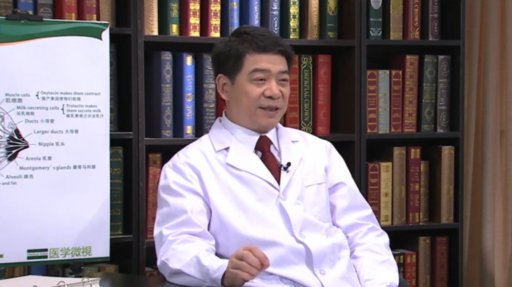

# 11.78 乳腺癌//孙强教授

---

## 孙强 主任医师

中国医学科学院附属北京协和医院乳腺外科主任 主任医师 博士生导师。

中国研究型医院乳腺专业委员会主任委员；中国老年肿瘤学会乳腺癌分委会主任委员；中国抗癌协会乳腺癌专业委员会常务委员；北京医师协会乳腺疾病专家委员会候任主任委员；北京乳腺病防治学会学术工作委员会主任及外科专业委员会主任委员；中国微循环学会常务理事。

**主要成就：** 发表SCI论文30余篇，累计影响因子80分；致力于乳腺疾病尤其是乳腺癌的基础与临床研究；获得“十一五”、“十二五”国家级项目2项以及北京市科委省部级项目4项支持。

**专业特长：** 对乳腺疾病的诊治有丰富经验；累计主刀乳腺癌手术7000余例，近年来每年乳腺癌手术量近700余例；擅长乳腺癌改良根治术、采用隐秘切口进行乳腺癌的保乳手术，并自创环乳晕切口的保乳手术，环乳晕单切口完成乳腺癌改良根治以及一期成型术；一贯倡导重视乳腺癌的早期筛查、早期诊断和早期治疗。

---
