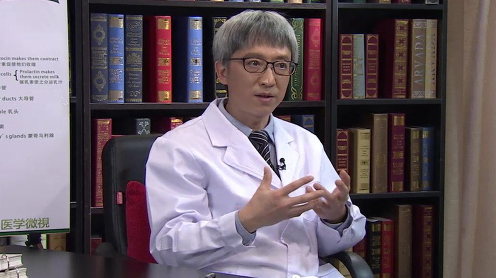

# 11.79 乳腺癌保乳治疗

---

## 徐青 主任医师

中国康复研究中心北京博爱医院普外科主任 主任医师 医学博士。

中国医师协会甲状腺医师专业委员会委员；中国医师协会腹膜后肿瘤与盆底外科专业委员会委员；中国研究型医院协会乳腺专业委员会委员；中国研究型医院学会甲状腺专业委员会委员；北京医学会乳腺专业委员会委员；北京乳腺疾病防治学会常委；北京预防与保健专业委员会副主任委员；北京乳腺外科与转化医学专业委员会委员。

**主要成就：** 举办4届“乳腺癌诊疗与康复论坛”，在规范甲状腺、乳腺疾病诊断与治疗的同时，注重患者功能康复及人文关怀，提出“一个乳房，一个病人；一个病人，一个家庭”的治疗康复理念；发表论文80余篇；完成国家自然基金、省部级课题8项。

**专业特长：** 擅长乳腺、甲状腺疾病诊断、手术治疗与综合治疗，乳腺癌康复，擅长结直肠恶性肿瘤腔镜外科治疗。

---
