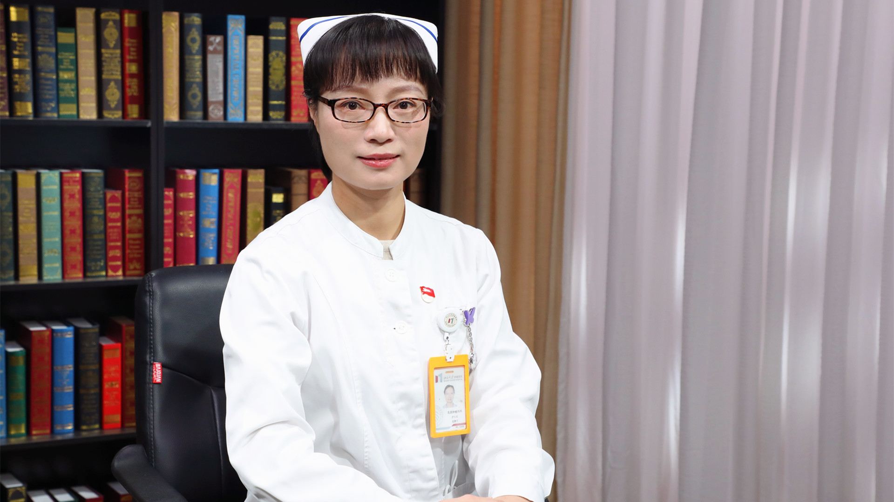

# 11.82 乳腺癌术后淋巴水肿的护理

---

## 尤渺宁 副主任护师

北京大学肿瘤医院乳腺肿瘤内科护士长 副主任护师 国际造口治疗师。

中华医学会整形外科分会淋巴水肿治疗学组委员；中华护理学会第27届造口伤口失禁护理专业委员会专家库成员；中国研究型医院学会护理分会伤口与静脉治疗安全学组委员；中国医药教育协会乳腺癌个案管理师分会第1届常务委员；北京乳腺病防治学会护理专业委员会常务委员；北京护理学会伤口造口失禁专业委员会委员。

**主要成就：** 参编肿瘤、伤口相关书籍6本，于核心杂志发表文章15余篇。

**专业特长：** 擅长癌性伤口和淋巴水肿的护理，近12年来共收治癌性伤口患者500余例、会诊伤口患者70余例，近3年来治疗淋巴水肿患者100余例；已获淋巴水肿综合消肿治疗培训合格证书。

---
