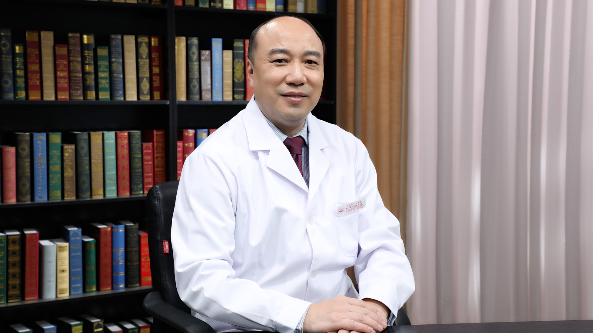

# 11.84 乳腺癌术后乳房再造

---

## 蒋宏传 主任医师

首都医科大学附属北京朝阳医院乳腺外科主任 主任医师 教授 博士生导师。

中国医师协会乳腺疾病培训专家委员会主任委员；北京医学会乳腺疾病分会副主任委员；中国妇幼保健协会乳腺保健专业专家委员会顾问委员；中国医促会乳腺疾病专业委员会副主任委员；中国整形美容协会乳房修复再造专业委员会副主任委员；中华医学会外科学分会乳腺外科学组委员；中华医学会肿瘤学分会乳腺癌学组委员。

**主要成就：** 发表学术论文50余篇，参编 《现代乳腺肿瘤学》和《中国肿瘤医师临床实践指南丛书:乳腺癌》等多部著作，《中华外科杂志》《中国微创外科杂志》《中华乳腺疾病杂志》等多个核心期刊杂志编委；在国内率先开展了乳管内窥镜诊断乳管内病变、真空辅助乳腺微创活检、乳腺癌术后乳房可调试假体重建乳房，并取得满意的效果，其中乳管内窥镜诊治、乳腺癌术后乳房即时再造的数量和效果均达国内领先水平；研究开展乳腺癌触诊阴性的肿瘤定位穿刺活检技术。

**专业擅长：** 擅长乳管内窥镜诊治乳管内病变、乳腺微创手术、乳腺癌规范化治疗，乳腺癌保乳综合治疗、乳腺癌术后即时乳房再造以及乳房美容。

---
