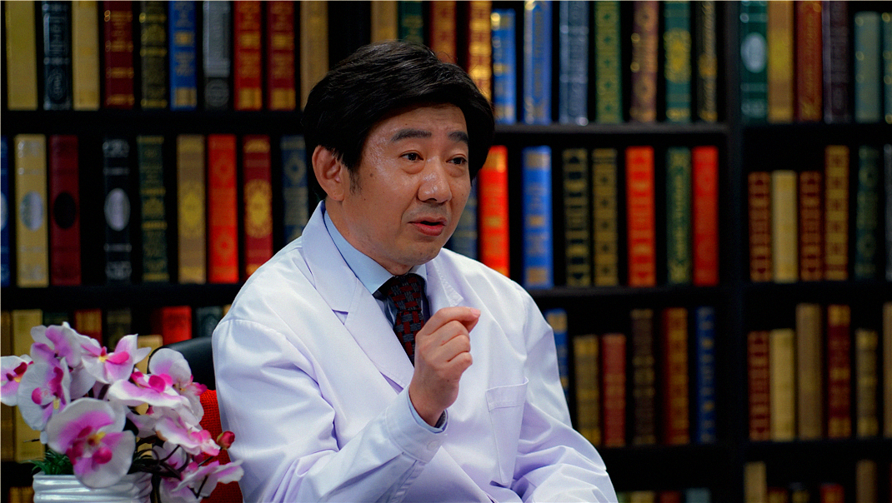

# 11.96 肾盂癌

---

## 李宁忱 主任医师

北京大学首钢医院吴阶平泌尿外科医学中心主任 主任医师 北京大学医学部研究生导师。

中国抗癌协会理事；中国抗癌协会泌尿男生殖系肿瘤专业委员会常务委员 膀胱癌学组副组长；北京医学会泌尿外科学分会常务委员 肿瘤学组委员；北京医学会肿瘤学分会委员。

**主要成就：** 1998年-1999年及2006年-2007年分别在日本德岛大学医学部泌尿器科及美国哈佛大学麻省总医院泌尿外科做访问学者，在国内外刊物发表文章数十篇，并多次在国内外学术会议上发表论文。

**专业特长：** 长期从事泌尿外科的临床、科研与教学工作，擅长腔内泌尿外科、泌尿系肿瘤的诊断与治疗，包括各种泌尿外科腹腔镜手术，经尿道腔内手术，对各种泌尿系肿瘤，特别是尿路上皮肿瘤、复杂性肿瘤、前列腺肿瘤的诊断与治疗有深入的研究。

---
