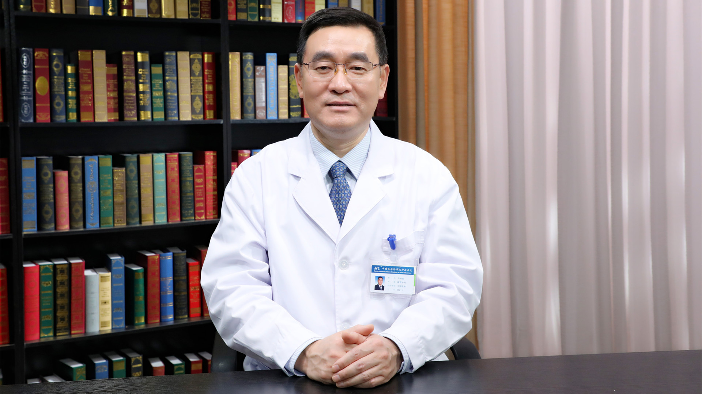

# 11.104 胃癌

## 田艳涛 主任医师

中国医学科学院肿瘤医院胰胃外科病区主任 主任医师 教授 博士生导师 院学术委员会委员。

中国抗癌协会肿瘤防治科普专业委员会主任委员；国家肿瘤质控中心胃癌质控专业委员会副主任委员；中国医师协会临床精准医疗专业委员会肿瘤代谢与治疗专业委员会（学组）主任委员；中国抗癌协会胃癌专业委员会常务委员兼外科学组副组长；中国医师协会医学科学普及分会副主任委员。

**主要成就：** 主持10余项国家自然科学基金及省部级课题；发表统计源核心期刊及SCI 论文230余篇；曾获省部级科技进步奖三等奖2项；主编科普书《漫画胃癌防治》获得中华预防医学会、中华医学会、中国抗癌协会、北京医学会等多项医学科学技术进步科普奖；担任 * World Journal of Gastrointestinal surgery* 、世界华人消化杂志和中国医学前沿杂志副主编、中国医刊杂志专业主编，国家重大出版工程项目、中国常见癌症丛书《胃癌》副主编。

**专业特长：** 长期从事胃癌、胰腺癌的外科临床及基础研究，擅长胃良恶性肿瘤、胃肠间质瘤，胰腺、十二指肠、胆管、壶腹癌及结直肠肿瘤腹腔镜微创外科及根治性手术。

---
