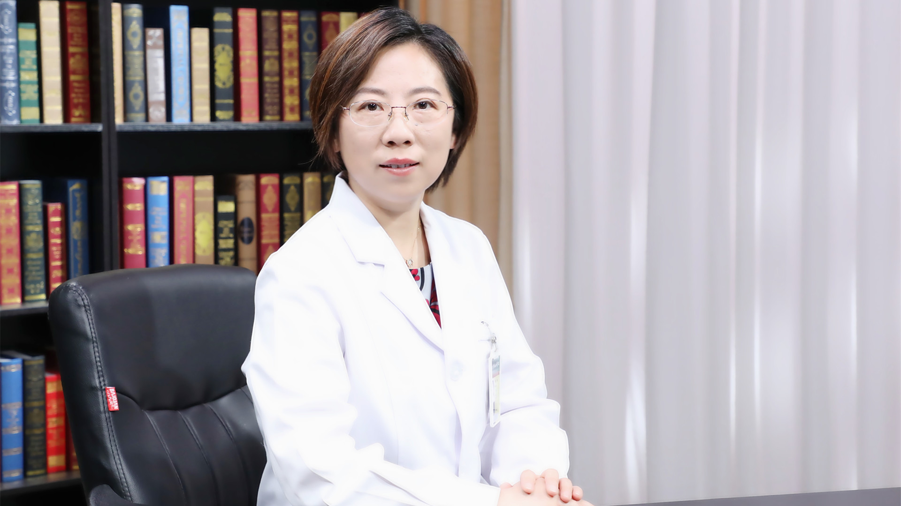

# 11.106 胃癌的药物治疗

---

## 赵林 主任医师

北京协和医院肿瘤内科 科室副主任 主任医师 硕士生导师 医学博士。

北京肿瘤防治研究会消化肿瘤专家委员会主任委员；北京抗癌协会食管癌专业委员会副主任委员；CSCO结直肠癌专家委员会委员；CSCO抗肿瘤药物安全委员会委员；国家远程医疗与互联网医学中心胃肠肿瘤专业委员会副主任委员；北京肿瘤病理精准诊断研究会副会长。

**主要成就：** 已撰写发表论著近60篇，其中第一作者或通讯作者论著25篇，发表SCI论文8篇，并参与了《抗肿瘤药物临床应用指南》《肿瘤内科诊疗常规》的编写；已有三篇摘要被美国临床肿瘤学会年会收录，并在2017年世界胃癌大会、2012年亚洲肿瘤学年会上做口头发言；先后获得中国医学科学院医学与健康科技创新工程、医学科学基金会、CSCO专项基金、中国抗癌协会专项基金、北京协和医院青年基金的科研资助，并参与了国家自然科学基金重点项目的工作。

**专业特长：** 擅长胃肠道肿瘤的化疗、靶向治疗和个体化精准治疗，在综合治疗方面有丰富的多学科协作诊治的经验；对合并严重基础疾病及并发症的疑难肿瘤患者具有独特的治疗经验。

---
