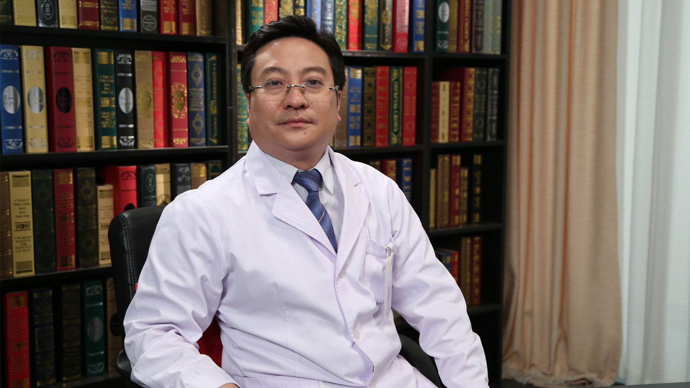

# 11.108 胃肠道间质瘤

---

## 李健 主任医师

北京大学肿瘤医院消化肿瘤内科副主任 主任医师 博士生导师。

中国医师协会外科医师分会胃肠间道质瘤专业委员会副主委；中国医学促进会软组织肿瘤专业委员会副主委；中国抗癌协会肿瘤药物临床研究专业委员会常委；中国临床肿瘤学会大肠癌专业委员会常委；中国临床肿瘤学会胃肠道间质瘤专委会委员。

**主要成就：** 获2016年华夏医学科技奖一等奖与2017年华夏医学科技奖二等奖；发表医学专著30余篇，SCI论文10余篇，以第一作者执笔2017版《中国胃肠道间质瘤诊断治疗专家共识》。

**专业特长：** 擅长消化道恶性肿瘤，特别是胃肠道间质瘤、结直肠癌、胃癌、食管癌等疾病的个体化药物治疗与多学科综合治疗，以及耐药机制研究；致力于抗肿瘤新药的转化研究与早期临床研究。

---
