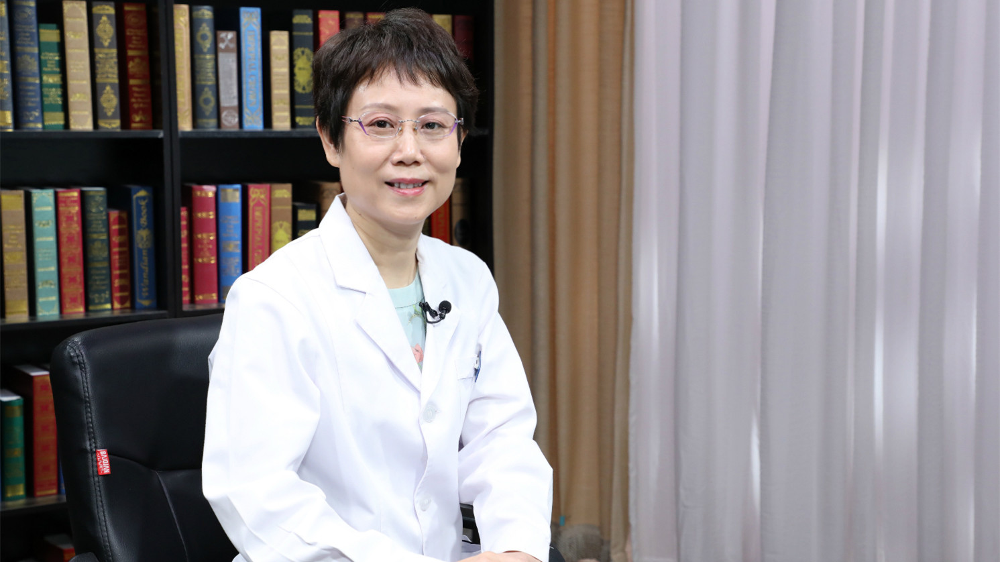

# 11.111 心脏肿瘤的病理诊断

---

## 陈东 主任医师

首都医科大学附属北京安贞医院病理科主任 主任医师 医学博士 硕士生导师。

血管专业组副组长；中华医学会病理学分会儿科学组委员；北京市病理质量控制和改进中心副主任委员；北京医学会病理分会常委。

**主要成就：** 国内外发表学术论文100余篇；参编参译《王士雯老年心脏病学》《临床病理学》《Pathology》《胃肠病理学》等专著；参与国家自然科学基金项目并主持北京市等省局级科研、科研转化及病理质控项目多项，获省部级科技成果奖三项；《中华病理学杂志》《心肺血管病杂志》《临床与实验病理学杂志》编委，《诊断病理学杂志》常委。

**专业特长：** 擅长心肺血管疾病病理专业研究。主办国家级继续教育项目《小儿先天性心血管畸形病理解剖学习班》、北京市继续教育项目《病理质量控制及管理》。

---
