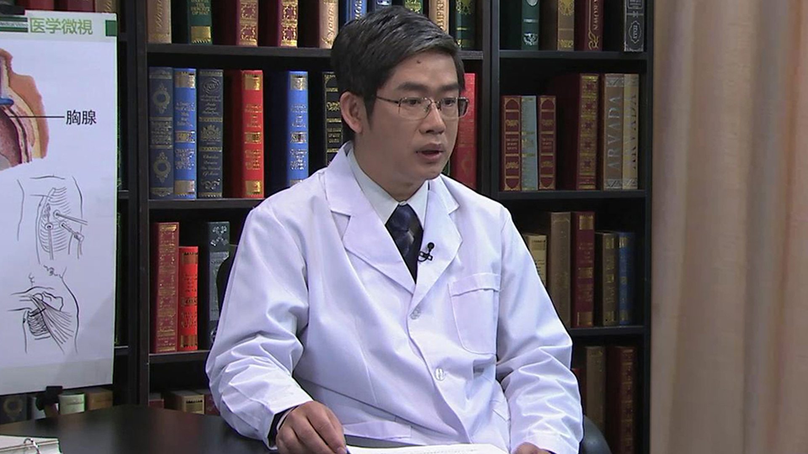

# 11.112 胸腺瘤

---

## 高志 主任医师

首都医科大学附属北京友谊医院胸外科主任医师 硕士研究生导师 医学博士。

北京胸外科医师协会青委会副主任委员,北京胸外科学会肺癌学组委员,国际肺癌研究会（IASLC）委员,北京市外国医师行医资格考核专家,浙江省自然科学基金评审专家。

**主要成就：** 2012年被评为北京优秀中青年医师；以第一作者和责任作者在国内外杂志发表文章36篇，参编著作2部；负责北京市自然科学基金项目1项，局级和院级科研项目各1项。 **专业特长：** 擅长肺癌胸腔镜微创手术治疗和化疗，擅长食管癌、贲门癌的手术治疗，擅长气胸和纵隔肿瘤等胸部其它疾病的胸腔镜微创手术治疗。在肺癌、食管癌、气胸及纵隔疾病的微创外科手术治疗以及肺癌的综合治疗方面积累了丰富的临床经验。

---
