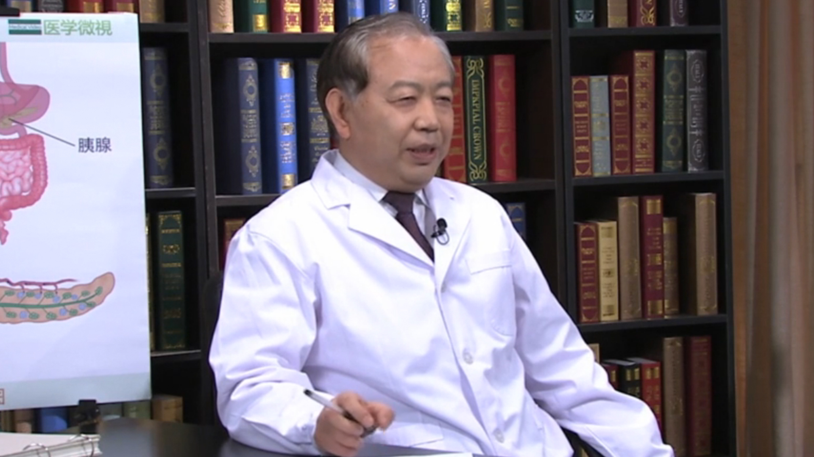

# 11.113 胰腺癌//王成锋教授

---

## 王成锋 主任医师

中国医学科学院肿瘤医院胰胃外科主任 主任医师 博士生导师。

中国医疗保健国际交流促进会胰腺疾病分会主委；中国医药教育协会腹部肿瘤分会主委；中国医疗保健国际交流促进会常务理事；中国医药教育协会常务理事；海峡两岸医药交流协会胰腺癌专委会主委；海峡两岸医药交流协会微创分会副主委；中国医疗保健国际交流促进会胰腺疾病分会胰腺癌术中放疗学组组长；中国医刊专业主编；中华肿瘤防治杂志等13种期刊（常务）编委。

**主要成就：** 发表论文200余篇，SCI论文60余篇，累计影响因子130分，单篇论文最高SCI 36.377；获教育部科技进步二等奖等奖10余项；承担国家及省部级课题20余项，致力于胰腺癌基因学及相关研究，发现国人特有的6个胰腺癌易感基因，并对其功能进行了初步研究，相关论文发表在Sciences子刊和Nature Gentics上。

**专业特长：** 擅长胰腺和胃肿瘤的诊治及相关基础研究。牵头制定胰腺癌和胃癌规范化诊治指南及专家共识等5项。开展了局部晚期胰腺癌术中放疗的临床和基础研究，样本量大、疗效好、副作用小，研究成果获国际和国内同行高度认可。

---
