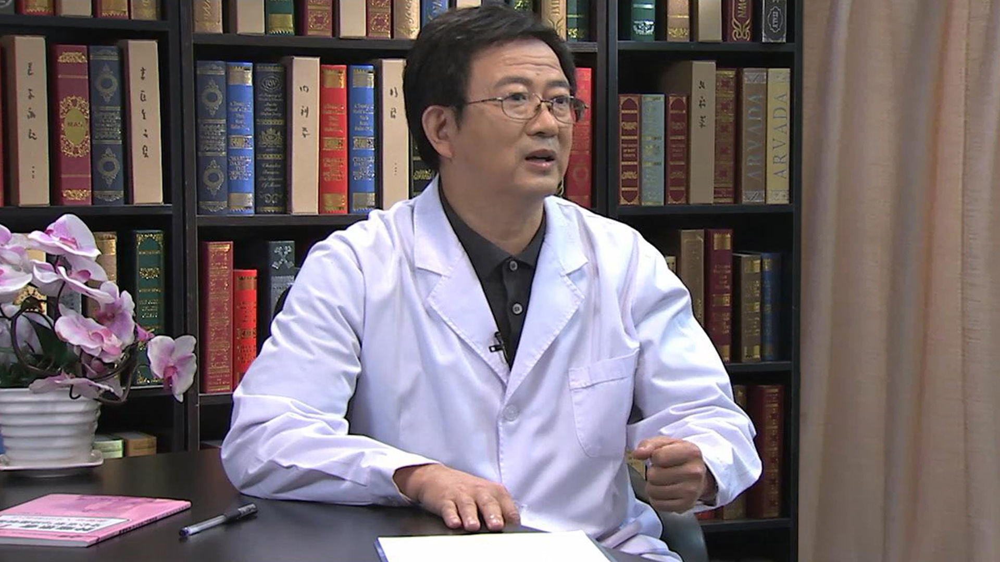

# 11.121 肿瘤患者心理干预治疗

---

## 朱广卿 主任医师

空军总医院肿瘤医院副院长 主任医师。

中国医师协会肿瘤医师分会第一届委员会委员；中国抗癌协会老年肿瘤专业委员会副主任委员；中国老年病学学会老年肿瘤专业委员会姑息分会副主任委员；中国老年病学学会老年肿瘤专业委员会执委；全军科学技术委员会肿瘤病学专业委员会常务委员；北京抗癌协会理事会理事；北京抗癌协会肿瘤心理学会副主任委员；北京乳腺病防治学会常务委员。

**主要成就：** 在国内外医学期刊发表学术论文60余篇；获二、三、四等军队科技进步奖、医疗成果奖10余项；主编参编专著6部。

**专业特长：** 长期从事临床实践与研究工作，近年主要从事恶性肿瘤的诊断和综合治疗，在恶性肿瘤的个体化治疗方面具有丰富的临床经验。擅长恶性肿瘤生物免疫治疗、局部消融治疗、肿瘤患者心理治疗和癌症疼痛管理方面也有较深入的研究。

---
