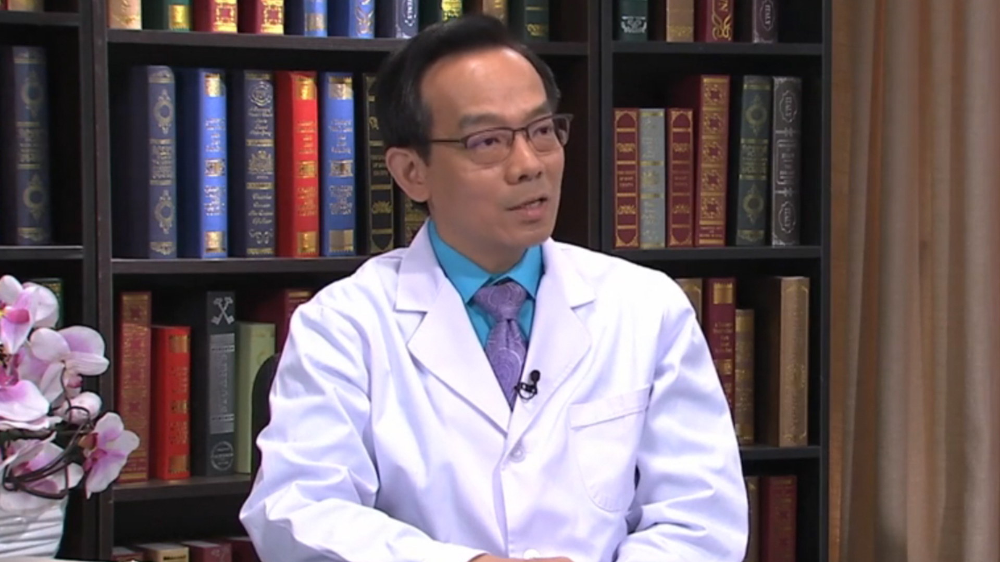

# 11.122 肿瘤免疫治疗

---

## 王珩 主任医师

美国南加利福尼亚州Methodist 医院前内科主任。

美国希望之光医疗首席医务长；美国肿瘤、血液和内科资格认证专家；世界华人医师协会华医智汇特聘专家；美国临床肿瘤学会会员；美国血液学会会员；美国医学会会员。

**主要成就：** 2010-2017年被美国《帕萨迪娜杂志》评选为顶尖肿瘤和血液医生；2015-2018年被美国《洛杉矶杂志》评选为顶尖肿瘤和血液医生；2012-2015年被美国消费者研究学会评选为顶尖肿瘤和血液医生；2014年获得美国生命攸关患者选择奖；在国际和国内SCI和学术会议发表论文和报告十余篇。

**专业擅长：** 肿瘤的化疗、生物治疗、分子靶向治疗、免疫治疗和激素治疗。

---
