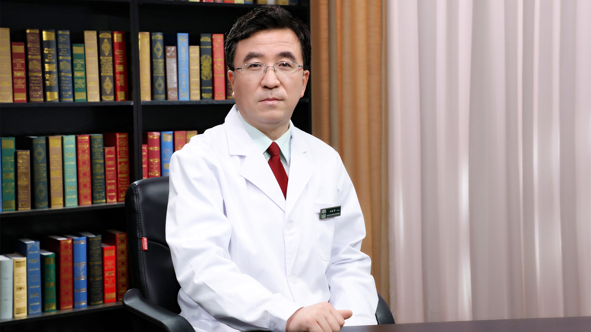

# 11.124 中西医结合治疗肝癌

---

## 汪晓军 主任医师

首都医科大学附属北京佑安医院中西医结合中心主任 主任医师 教授 博士生导师。

中华中医药学会感染病分会副主任委员；中华中医药学会肝胆病分会常务委员；北京中医药学会感染专业委员会主任委员；北京中医药学会肝病专业委员会副主任委员；中国中药协会肝病药物专业委员会副主任委员；中国民族医药学会脾胃病 传染病分会常务理事；《中西医结合肝病杂志》《国际病毒学杂志》《北京医学》编委。

**主要成就：** 发表核心及SCI学术论文50余篇，出版专著7部，其中主编及副主编3部；先后承担“十一五”“十二五”“十三五”重大专项、国家自然科学基金、首都医学发展科研基金等10多项课题；获华夏医学科技奖2项；荣获“首都中青年名中医”“首都中医榜样人物”称号；北京首届中医药复合型学术带头人，北京市高层次医学骨干，北京市中医药管理局“125计划”优秀人才，北京市科技新星；北京市抗击新冠肺炎疫情先进个人。

**专业特长：** 擅长慢性肝病、肝癌及感染病的中西医结合临床与基础研究。

---
