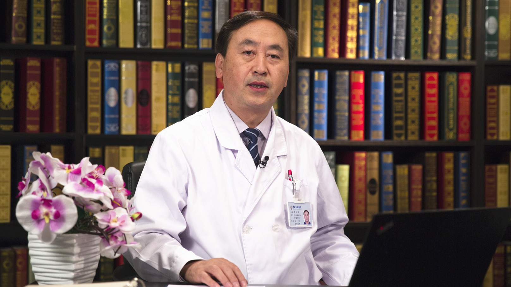

# 11.125 中医改善体质 预防肿瘤复发

---

## 贾立群 主任医师

中日友好医院中西医结合肿瘤内科主任 主任医师 博士生导师 享受国务院特殊津贴。

中华预防医学会中西医结合预防与保健分会主任委员；中华中医药学会肿瘤分会副主任委员；中国中医药研究促进会肿瘤专业委员会主任委员；中华中医药学会理事。

**主要成就：** 近5年承担国家级课题6项；先后获得省部级科学技术奖6项；近年发表学术论文百余篇；主编和参编学术专著20部；创办了基层肿瘤专科建设联盟。

**专业特长：** 擅长中西医综合治疗消化道肿瘤、脑瘤；中医外治放化疗不良反应、中医外治浅表性肿瘤及前列腺癌；经络疏导康复疗法。

---
