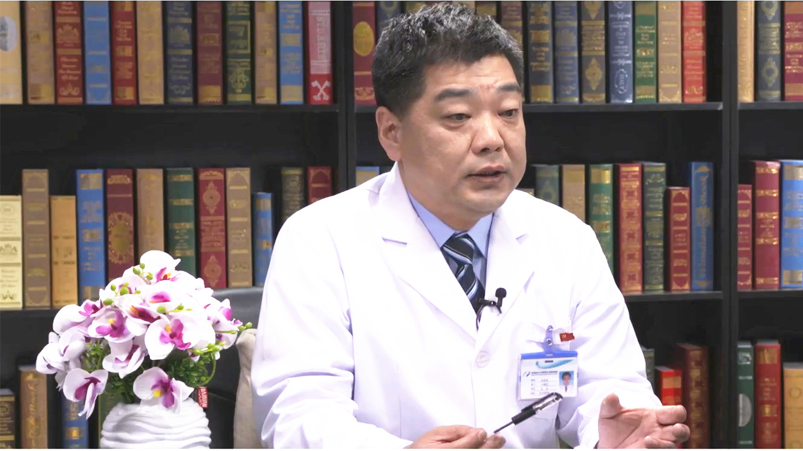

# 11.129 纵隔肿瘤

---

## 刘志东 主任医师

首都医科大学附属北京胸科医院胸外二科主任 主任医师 博士生导师.

中国医促会胸外科分会常务委员；北京医学会胸外科专业委员会常务委员；中国医师协会内镜医师分会胸外科内镜与微创专业委员会暨内镜与微创专业技术全国考评委员会胸外科内镜与微创专业委员会理事。

**主要成就：** 发表SCI收录论文26篇，总影响因子62.209；主持实施国家“十三.五”计划子课题及北京市科委重点项目等多项重大课题；2006年“胸部肿瘤侵及上腔静脉系统血管的外科治疗”研究项目获得北京市科学技术二等奖；2014年获得“中央人民广播电台”评选出的“京城好医生”。

**专业特长：** 从事临床胸外科专业20年来，完成胸外科各类手术近2000例。在胸部肿瘤包括肺良性肿瘤、肺癌、纵隔肿瘤、食管癌等疾病及难治性肺结核的诊断和外科治疗，包括胸外科疑难复杂重症手术、中晚期胸部肿瘤的术前可切除性评估、外科技术和围手术期管理等方面具有丰富的理论知识和临床经验。

---
