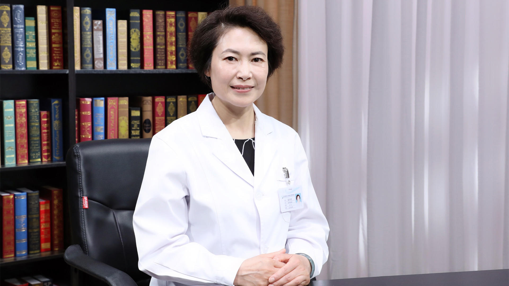

# 11.130 纵隔肿瘤的CT检查

---

## 吕平欣 主任医师

首都医科大学附属北京胸科医院影像科主任 主任医师.

中国防痨协会影像专业分会主任委员；中华医学会结核病学分会影像专业委员会委员；北京医学会放射学分会第十二届委员；北京医学会核医学分会第十届委员；北京市核医学质量控制和改进中心专家委员会委员；《中国防痨杂志》第九届编委。

**主要成就：** 从事医学影像诊断工作28年，发表专业论文40余篇，参编论著6部；曾参与和正在进行国家重大专项、国家自然科学基金、北京自然科学基金等省部级以上科研项目7项。

**专业特长：** 擅长肺癌、纵隔肿瘤、胸膜肿瘤等胸部肿瘤的影像诊断与鉴别诊断；擅长胸部结核和其它肺外结核的影像诊断和鉴别诊断，尤其擅长胸部疾病的CT诊断和PET/CT诊断。

---
