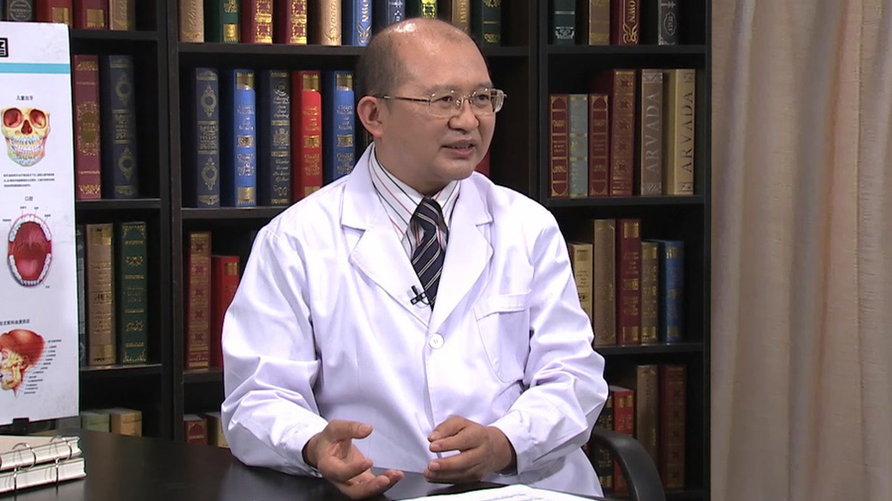

# 成人牙髓及根尖周病

## 黄定明 主任医师

四川大学华西口腔医院牙体牙髓科主任 口腔医学博士 主任医师 博士生导师；

四川省口腔医学会牙体牙髓病学专业委员会主任委员；中华口腔医学会牙体牙髓病学专业委员会委员；《国际口腔医学杂志》编委；《牙体牙髓牙周病学杂志》编委。

**学术成就：** 发表中文论著100余篇，SCI论著30余篇，参编国家本科规划教材《牙体牙髓病学》、研究生规划教材《牙髓病学》以及《实用牙体牙髓病学》等专著10部；从事牙体牙髓疾病的基础与临床研究，负责国家级科研项目4项，省部级科研项目4项，系列研究成果获得了中华医学会科技进步三等奖、教育部科技进步一等奖、四川省科技进步一等奖以及国家科学技术进步二等奖。

**专业特长：** 长期从事牙体牙髓根尖周病的病因、现代诊治技术及其临床应用研究，擅长牙体牙髓病诊治技术，尤其是应用显微根管治疗技术、显微根尖外科手术等现代技术诊治牙髓根尖周病的疑难病例，积累了丰富的临床经验。

## 什么是成人牙髓病及根尖周病？

牙髓、根尖周疾病，是一种疾病发作的不同阶段，如果说疾病局限在牙齿内部，也就是牙髓组织的话，那这个时候就称为牙髓病，如果说牙髓病没有得到及时的治疗和处理的话，那么它可能引起牙髓坏死，进一步累及到牙齿的根尖周组织，从而形成根尖周疾病。

两种疾病的根本原因就在于，定植在口腔环境中的细菌，感染了牙髓组织，并且导致牙髓组织的坏死，细菌进一步扩散到根尖周组织，引起所说的免疫炎症反应，导致根尖周组织的破坏。

另外在临床上的主要表现是疼痛，以及咀嚼的时候不适，到了后期可能引起颌骨的感染，面部的肿胀，以及牙龈反复流脓的这种临床表现，其实质就是牙髓根尖周组织，受到细菌感染所引起的一类感染性的疾病。

如果说注重口腔卫生的话，那么龋病得到有效的控制，有效的治疗，都会阻止疾病的发展，避免引起牙髓、根尖周疾病。

然而许多百姓并不知道早期预防，早期治疗，往往是牙齿出现了疼痛不适，然后去找口腔医院就诊，这个时候已经累及到牙髓组织了，累及到牙髓组织就需要做牙髓治疗。

往往临床医生每天接诊的患者，主要就是这种已经发展到牙髓病或者根尖周疾病的患者。所以总的来说，通过流行病学调查，我国发病率已经高达就是说百分之五六十左右。

## 引起成人牙髓病及根尖周病的原因有哪些？

引起成人牙髓病和根尖周疾病最常见的原因，也是最核心的因素，就是细菌的感染。

细菌在口腔内有几百种，并且在口腔唾液中也定植着大量的细菌，如果说牙齿被破坏了，那么这些口腔里面的细菌，可能通过破坏的牙体组织内部的牙本质小管，感染牙髓组织，临床上最常见引起牙髓、根尖周疾病的原因是龋病，老百姓所说的虫牙。

它将牙齿表面的完整性破坏了，那么在牙体硬组织内部的牙本质小管，就为细菌进入到牙髓组织提供了一个通道，这是临床上引起牙髓根尖周疾病最常见的途径。

另外一种就是外伤，例如打篮球，骑车，走路不小心，把牙齿摔了，摔折了，那么牙本质暴露了，同样为环境中的细菌进入到牙髓组织，引起牙髓的感染提供条件。

除了外伤的话，如果说有严重的牙周病，牙周袋内定植着大量的微生物，这些微生物不是从牙齿的上段进去，而是从牙齿侧方的侧支根管以及根尖孔等，逆行性的进入到牙髓组织，引起牙髓的感染，从而形成牙髓病。

## 如何早期发现成人牙髓病及根尖周病？

临床上引起牙髓感染最常见的途径就是龋病，可以看到牙齿表面的颜色发生改变，例如早期成白垩色，逐渐在牙齿表面形成一个洞，最后就烂到牙齿的内部，牙齿的表面缺了一块，完整性被破坏，同时质地也变软。

这些龋洞里面，其实定植着大量的微生物，如果说平时自己小心一点，去看看医生，牙髓还没有受到影响的时候，医生将龋坏组织去除掉，感染清除掉，并且用材料将牙齿缺损的部位，严密地封闭起来，这样的话就会阻止细菌去影响到牙髓组织。

另外如果说一个患者，他对自己牙齿的健康不重视，觉得缺一块少一块没关系，那么龋病就会继续破坏牙体组织，并且随着龋病的发展，越靠近牙髓组织，那么这个患者就可能出现一些表现，例如吃冷的、热的、酸的、甜的，这个时候可能感觉到一点不舒服。

同时咀嚼食物的时候，如果食物进入到这个龋洞里面，一咀嚼的时候，他也感觉到疼痛。那么这个时候，其实尽快的去找医生诊治的话，把牙髓病消灭在该阶段，也能够保存健康的牙髓组织。

再进一步发展的话，如果患者仍然没有去看医生，那么口腔里面的细菌，窝洞里面的细菌，就可能直接进入到牙髓组织，感染牙髓组织，这样的话，会引起牙髓组织的发炎、肿胀以及坏死。

牙髓组织是在外层包绕着一层坚硬的牙体组织，发炎过后，里面组织水肿，压力增高，这个时候坏牙就出现剧烈的疼痛，并且有时候牵扯到同侧的面部疼痛，放射到耳部等部位，所以牙痛不是病，痛起来要人命，特指该阶段。

## 引起口腔异味的原因有哪些？牙髓病及根尖周病会引起吗？

引起口腔异味的原因有很多，其中牙髓、根尖周疾病是引起口腔异味的主要原因。

牙髓、根尖周疾病，它其实是一种细菌感染性的疾病，那么细菌在这个坏的龋洞里面，它可能分解唾液中的蛋白，可能分解进食当中的蛋白、糖，可能产生一些胺类的分子，这样的话导致口腔异味的产生。

除了牙髓、根尖周疾病导致口腔异味的产生以外，还和患者注不注重口腔卫生，刷不刷牙有关。如果说一日三餐不刷牙，进食过后不漱口，那么在口腔里面的这些食物残渣，也可以被定植在口腔内的细菌分解，产生一些异味。

除此以外还有牙周病，牙周病其实也是一种，由特异的致病菌所引起的细菌感染性疾病。那么牙周病许多都是由一些厌氧菌导致的，它分解蛋白，产生一些有气味的分子，也会导致有些患者出现口腔异味的情况。

除此以外，还有全身健康状况，例如糖尿病，还有肾病，这些有可能导致呼出的气体带有一点异味。

## 成人牙髓病及根尖周病的根管治疗是如何做的？

目前认为根管治疗是治疗牙髓病及根尖周病最有效的方法之一，也是临床上首选的治疗方法。

根管治疗就是通过物理的、化学的方法，清除根管系统里面的感染物，包括细菌、残存的牙髓及细菌的代谢产物，从而使发生了牙髓、根尖周疾病的根尖周组织病变愈合，同时预防根尖周组织的再次感染。

根管治疗分为四大步骤：

第一大步骤就是开髓，开髓就是进入牙髓组织的一个通道，往往在牙齿的颌面开一个窗，这样的话，在整个根管治疗过程中，器械、材料、药物能够顺利到达整个根管系统，从而使根管系统内的微生物及其感染组织得到彻底的清除。

开髓之后，就是用器械以及药物来进行根管的清理，主要是通过镍钛锉来进行机械性预备，机械预备主要是成形或清除根管壁表面的这种感染物。

往往单纯的根管的机械预备，是无法彻底清除根管系统内的感染物的，这就需要在进行在根管预备过程中，采用根管冲洗液进行根管的化学预备，从而将根管内残存的细菌以及感染物彻底地冲出根管，实现根管内的一个无菌状态。

那么第三步就是根管的消毒，尽管在根管预备过程中，采用了镍钛器械或者是其它不锈钢器械的一个机械成形，以及根管冲洗液的一个化学预备，但是由于根管系统的复杂性，里面有些侧支根管，还有一些根管的狭部，还有根尖分歧，这些地方采用单纯的根管预备和化学冲洗的话，还是无法清洁这些部位的细菌。这个时候就需要封上一些，例如氢氧化钙，氯己定这些化学药物，封入到根管系统内，从而实现对残存细菌的杀灭作用，这就是临床说的第三步，根管的消毒。

根管消毒后，根管系统里面的细菌彻底被杀灭了，这个时候可以进行根管治疗的第四步，根管的充填。

根管充填的主要目的，一个是包埋，埋葬残存在根管内的感染物及其细菌，另一方面主要是将整个根管系统进行严密的充填，填的是根管的根尖孔，侧支根管这些部位。这样的话，使根管内残存的微生物或者是口腔中的微生物，从冠端进入到根管系统的这些微生物，不会到达根尖周，从而预防根尖周疾病的发生。

归纳起来，根管治疗主要包括开髓、根管的预备、根管的消毒以及根管的充填这四大步骤。

## 哪些因素会影响到牙根管治疗的成功率？

根据不同的情况，根管治疗的成功率可能存在不同。有的文献报道是百分之六七十的，也有报道是百分之八九十的，主要取决于患牙的情况以及医生诊疗情况。

首先第一个，患牙本身它的感染情况，如果只是早期牙髓炎，它的感染只是局限于冠部，根管里面细菌还没有进入，这个时候只要医生注意操作过程中，不引起根管内感染，那么就可以取得很好的成功率。国外文献报道，这种情况的两年成功率可以高达94%。

如果说细菌已经进入到根管系统，但是这个时候还没黏附到根管壁上面，还没进入到牙本质小管或者侧支根管根尖分歧里面，可能经过治疗也能获得一个好的结果。

如果说细菌已经进入到牙本质小管，进入到侧支根管，根尖分歧以及根尖周区了，那么这个时候对医生的操作技术，对治疗的条件，治疗的设备，就要求得很高，可能就没有刚才那种情况的治疗效果好。

做根管治疗的目的就是控制、清除根管系统的感染，使根管维持在一个无菌的状态。因此残存在根管里面的细菌，就可能引发根管治疗的失败，也就是说这些残存的细菌，可能通过根管系统的根尖孔到达根尖周组织，引起根尖周组织的再次感染，从而导致治疗的失败。

所以说成功与否，关键看患牙根管系统的感染，是否得到了有效的控制和管理。对于患牙来说，应该是早期发现，早期治疗，尽早去找医生做规范的根管治疗，这样才能保证一个良好的治疗效果，一个高的成功率。

另一方面，除了患牙的感染情况以外，还有就是患牙本身的解剖情况，也就是说根管复不复杂。

如果说一个患牙，它根管不复杂的话，一般都能够获得良好的感染控制，这个时候也能获得一个满意的治疗效果。

如果说牙齿长得又弯，牙根又弯，根管又细，并且还有一些侧支根管，根尖分歧，那么这个时候，对于医生的治疗技术以及医疗设备要求就更高。

特别是当细菌进入到侧支根管，以及根尖分歧的这些部位，即使采用了现代的技术，也许有时候治疗效果不尽人意。

所以说同样是牙髓、根尖周疾病，这一次找这个医生治疗好了，下一次同样找这个医生却不一定可以治好。

## 牙根管治疗中，医生是如何做根管预备的？要注意什么？

根管预备最基本的目的，就是希望通过进行一个预备，清除根管内的感染，同时为下一步的根管充填，预备成一个便利的形状。

成形主要借助于根管预备器械，对根管内壁进行切削，产生一个通道。切削过程中，将根管壁表面的细菌切削下来，同时也将感染的牙本质切削下来。

这样的话，主要是清除感染，同时还为化学预备，也就是说根管冲洗液进入到根管系统建立一个通道，也是为进一步的根管充填，提供一个空间，所以说这个机械预备非常的重要。

化学预备就是将器械切削下来的一些牙本质碎屑，通过一些化学药物进行冲洗，将其冲出根管系统。

冲洗液种类不同，它的作用也不同。理想的冲洗液作用，它既要有杀菌作用，也要有溶解有机质的作用，还有鳌合切削下来碎屑的里面的形成玷污层内的那种钙离子的作用，同时还有良好的组织相容性的作用，包括对周围的组织没有损伤，对牙齿的结构没有破坏，这些因素综合起来决定冲洗液好不好。

目前临床上最常用的根管冲洗液是次氯酸钠。次氯酸钠有溶解有机质的作用，也就是说牙本质碎屑里面的有机质和次氯酸钠，它能够溶解掉，同时它本身也具有一定的杀菌作用，使根管系统内的细菌能够得到清除。

但是次氯酸钠没有鳌合作用，这样的话在根管机械预备过程中，在根管壁表面产生的玷污层是无法清除掉的。而玷污层内含的有细菌，除了用次氯酸钠冲洗以外，还要用具有鳌合作用的EDTA来进行冲洗，使根管壁表面的玷污层，得到一个彻底的溶解和清除。

除了次氯酸钠以及EDTA以外，在进行根管冲洗、化学预备过程中，还需要洗必泰，也就是氯己定。氯己定能够杀灭包括粪肠球菌在内的多种微生物，而次氯酸钠没有这个作用。

目前研究表明，导致根管治疗失败的主要致病菌就是粪肠球菌，那么通过洗必泰的冲洗，将残存在根管里面的粪肠球菌杀灭掉，这样的话，保证在根管充填前，根管内获得一个良好的生态环境，也就是一个无菌的生态环境。

（采访）在这个过程当中，有什么是需要特别注意的吗？

因为次氯酸钠有溶解有机质的作用，因此在临床上选用浓度的时候一定要小心。随着次氯酸钠浓度的增高，它溶解有机质的作用就越强，对根管的清洁作用可能会增强。

但是有一点，如果说在临床上冲洗不小心的话，冲了根尖周组织，或者是次氯酸钠喷洒在口腔黏膜上面，甚至不小心喷洒在患者的眼睛里面，这就严重了。

所以说在用次氯酸钠进行冲洗的时候，选择浓度时，一般建议选择1%-2%的次氯酸钠。如果说选择5%以上的次氯酸钠的话，建议大家一定要采用橡皮障，将患牙严密的隔离开来。

同时在冲洗的时候，一定注意不要加压冲洗，以及冲洗空针与根管壁之间，要有一个冲洗液回流的通道，避免冲洗液溢出根尖孔，导致根尖周组织化学性的损伤。

## 什么是牙根管预备中的根管偏移？

理想的根管预备是顺着原来根管的解剖走向形成一个通道，所谓的根管偏移，就是没有沿着原来天然的根管走向，而偏向一边，这种情况的发生，往往表现成几种形式：

第一个轻微的就是根管壁一边切削的多，一边切削的少，这是最轻微的。

重一点的可能在根管弯曲的地方，形成一个台阶，或者是肘部。

更严重的可能导致侧穿，还有根尖孔的拉开，这样的话，可能导致一些治疗过程中的并发症。

（采访）它会带来哪些具体的危害？

首先根管偏移过后，根管壁的一侧牙本质过度的切削，另外一侧根管壁的牙本质没有预备到。如果说是一个感染根管的话，也就是说根管壁表面定植有细菌生物膜的话，那么没有预备到的一侧根管壁的细菌生物膜，原封不动的留在根管内，这样的话没有实现根管预备的目的，清除根管内感染。

其次根管偏移过后，如果形成了台阶，或者是肘部，这样的话，对于下一步的根管的充填也是比较难办的。

如果说再偏移的厉害，根尖孔拉开的话，那么可能治疗过后，患牙就始终感到不舒服、疼痛、不能咀嚼东西。

所以说根管的偏移，小则就是根管的清洁达不到目的，大则就可能引起患牙的治疗过后疼痛不适，不能实现咀嚼功能。

（采访）如果出现这种情况该采取哪些治理措施？

如果形成了轻微的偏移，可以采用合适的充填技术，对根管能够严密的充填。

如果说已经产生了台阶，这个时候台阶下方根管内的感染去除不掉，可能影响到治疗效果，这个时候尽量重新建立根管的通道，将台阶下段的感染物去除，才能获得一个良好的效果。

如果说根尖孔已经拉开了，那么在临床上可以用一些具有良好的抗菌作用，和严密封闭效果的一些纳米陶瓷材料，例如MTA，还有就是iRoot BP等这些材料，进行一个根尖屏障的形成，将拉开的根尖孔严密的封闭起来，也可以取得一定的临床效果。

（采访）为了在治理过程当中，不出现根管偏移的这种情况，可不可以采取一些预防措施？

首先在治疗前，需要对患牙的根管解剖，有一个全面的正确的评估，这就需要医生掌握牙片的识别，也就是说在进行根管治疗前，一定要对患牙照一张牙片，这样的话初步了解根管的走向，以及根管是否弯曲，根管是否细小。

如果说临床上根管弯曲、细小的话，那么在预备的时候，首先选择比较小号的不锈钢的K锉，例如6号，8号，10号，进行一个疏通，并且在这个疏通的过程中，一定要对器械有一个预弯的形态评估，与在根管影像学的形态基本一致，这样的话就可以避免根管的偏移。

同时在预备过程中，除了器械方面的选择、预弯注意以外，还有就是要边疏通，边用冲洗液冲洗，这样的话避免切削下来的牙本质碎屑堵塞根管的末端，导致进一步预备的时候，产生不必要的根管偏移。

## 牙根管治疗过程中，根管填充的目的是什么？

根管填充的目的就是严密封闭根管系统，一方面避免根管系统的再次感染，另一方面就是将根管系统严密封闭了，残存在根管系统内的微生物，就不会通过根尖孔或者侧支根管到根尖周组织，引起感染。

另外根充目的是包埋残存在根管系统的微生物或者感染物，从而达到根管系统与根尖周组织不相通的目的。

首先封闭整个主根管，只要将主根管系统封闭好了，那么主根尖孔这个通路，与根管系统，与根尖周组织之间交通的主要通路就被切断了，这样的话根管里面的微生物就不会进入到根尖周组织。

另一方面，如果主根管充填严密了，将整个根管壁表面封闭了，那么残存在牙本质小管内感染的微生物，它就不会进入到根管系统内，从而避免了根管系统的再次感染。

另外如果主根管充填严密了，侧支根管根尖分歧与主根管之间的通路被封闭了，也就是说在这种情况下，即使根管系统里面残存一些微生物的话，这些微生物也不会通过侧支根管或根尖分歧，进入到根尖周组织，引起根尖周感染。

所以说现在提出了一个概念，一定要实现根管系统的3D严密充填，也就是一个立体的严密充填，这样的话才能真真实实地，将根管系统与根尖周组织的交通，达到完全的阻断。

## 牙根管填充常用的材料有哪些？

尽管通过根管预备，将根管系统形成了一个比较良好的形态，但是由于根管系统的复杂性，侧支根管、根管峡部这些不规则的地方，需要具有流动性非常好的材料去进行充填。

所以说临床上根管充填的材料，不单单有一个主材，也就是说牙胶尖，还要有一个根充糊剂。这样的话，主根管的形态，主要由牙胶来进行封闭充填，而对那些比较细小的结构，例如侧支根管，还有根管的峡部，可能就需要借助糊剂的流通性，来进行一个充填封闭。

临床上主要的成形材料就是牙胶尖，在选择牙胶尖的时候，主要看一看牙胶尖的形态、大小、锥度，和预备根管的形态是否匹配。

同时在选用根管的充填糊剂的时候，最好选择一些流动性比较好，具有抗菌作用，同时凝固收缩比较小的材料，这样的话可以有效地封闭根管系统。

## 根管填充的方法有哪些？各自有什么特点？

目前临床上常用的根管填充方法主要有三种：

第一个是单尖法，就是说选择一个牙胶尖，与预备到主尖锉的这个根管的大小相匹配的牙胶尖，用一根牙胶尖沾一点糊剂，然后进行根管的充填。

第二种方法就是冷牙胶侧方加压充填法。这种方法就是选择一根主牙胶尖，将主根管的根尖孔严密封闭，用其它的副尖逐步将整个根管填充满。

第三种方法就是热牙胶垂直加压充填法，就是将牙胶加热软化，同时用一个垂直加压充填器来给予一定的压力，让牙胶适应于根管的形态，将其进行严密的封闭。

大家就觉得单尖法的话，充填起来比较简单，一根牙胶粘点糊剂充填就好了。其实由于现在的糊剂，它凝固了，体积会发生收缩，凝固过后的根充糊剂，与根管壁之间有个缝隙，与牙胶尖之间也有一个缝隙，这些缝隙足以细菌通过。所以说单尖法对于根管充填的封闭性，或者是能否充填严密，有一个大大的问号。

除了单尖法以外，冷侧方加压充填法它选择的是一个标准的02锥度的牙胶尖，来进行根尖孔的适配，与预备器械大小以及根尖孔大小相匹配。那么通过主牙胶尖，将根管的根尖孔封闭，然后用侧方加压，将主尖向一侧推，留下空间，插入副尖。

这样的话，在充填过程中就需要不断的插入牙胶尖，比较费时、费力。侧方加压充填过程中，往往可能引起牙胶尖与牙胶之间产生缝隙。

另外还有充填的牙胶尖，有时候不可能和根管的形态相匹配，这样的话，充填的牙胶尖与根管壁之间，可能还是有缝隙。

另外一些不规则的根管形态，例如根管峡部，牙胶尖或者是糊剂可能无法进入到这些凹陷的地方，从而导致无法严密地充填根管系统。

但是如果说在充填的时候，主尖，主牙胶尖选择匹配的话，将主根尖孔，特别是根管的根尖三分之一，达到一个严密充填，这种方法也能够取得良好的临床效果，只不过充填过程比较繁琐，比较复杂。

第三种方法就是现在提倡的热牙胶垂直加压充填法。牙胶常温情况下是一个比较硬的固体，当牙胶加热过后，它就变软，具有一定的流动性和可塑性，这个时候将加热过后变软的牙胶，用垂直加压充填器进行挤压的话，那么它会推动牙胶周围的糊剂，向侧支根管以及牙本质小管内流动。

同时由于加热软化的牙胶，它有一定的可塑性，这样即使不规则的根管形态，它也能够获得一个严密的充填，使整个根管系统都有牙胶的填充。

所以为了实现根管系统的严密充填，现在建议首选热牙胶垂直加压充填技术。

## 什么是意向性牙再植术？

意向性牙再植术是保存患有牙髓、根尖周疾病患牙的最后一个手段。

主要是指将患牙从口腔内拔除，在体外针对引起患牙发生牙髓、根尖周疾病的病因进行处理治疗。在体外治疗结束后，再次将该牙植入牙齿原来的位置，主要是为了将患牙，自己的真牙保留在口腔内，并且能够健康的保存。

意向性牙再植术主要是消除引起牙髓、根尖周疾病的病因，同时让根尖周已经发生病变的组织得到修复重建，并且实现患牙的咀嚼功能。

临床上如果患牙通过其它的治疗方法，例如根管治疗术、根管再治疗术、口内的显微根尖外科手术，能够解决问题的话，不推荐采用意向性牙再植术。如果说以上的这些治疗方法，不能解决患牙疾病的话，那么可以推荐采用意向性牙再植术。也就是说意向性牙再植术，主要用于临床上采用一般治疗方法不能解决的疑难杂症。

## 意向性牙再植术前，需要做哪些准备和评估？

术前准备对于手术成功与否，往往起着关键性的作用。

术前准备首先包括术前的检查，术前检查不单单只看到患者的这一颗牙齿，还要了解患者的全身健康状况，例如是否有高血压，心脏病，糖尿病以及肾脏的疾病情况。这样患者全身情况比较好的话，牙再植术的成功率才有一个保证，所以说在术前要了解患者的全身情况。

其次要了解患者的口腔健康状态，如果患者口腔卫生一直较差，又患有严重的牙周病，那么这个时候，如果选择意向性牙再植术，它成功的几率，还有长远的疗效可能受到影响。

除了患者的口腔健康状况以外，还要了解一下将要进行意向性牙再植的患牙的情况：

第一就是说做了意向性牙再植，这个牙齿保存下来了，那么保存下来之后，它后期的功能有多少。如果说保存下来，它后面行使的功能比较少，那么进行意向性牙再植的意义就不大了。因此在进行术前检查的时候，要评估一下患牙保存下来的意义有多大，这是第一。

第二要评估一下，患牙的牙冠情况。如果患牙残存的牙冠组织太小了，就有可能在拔牙过程中将牙冠拔断，这个时候就无法进行意向性牙再植。

还有就是患牙的牙周情况，如果说患牙牙周情况不好的话，那么再植回去重新长活起来就比较困难了。

还有就是除了牙体牙周情况以外，术前需要拍张X片，甚至现在的三维检查，CBCT，也是锥形束CT的检查。这样在治疗前，对患牙的根管解剖，还有牙齿的牙根形态，牙根数目以及与牙齿周围重要的、临近的解剖结构，有一个全面清晰的认识和评估，从而在治疗的时候，医生才能做到心中有数。

（采访）患者应该做哪些准备？

首先患者应该在治疗前，到牙周专科诊室进行全口的口腔护理，也就是说对口内的这些残存细菌、菌斑进行彻底的打扫，这样再植的时候，相对来说口腔内微生物的种类数量会少得多，为再植的成功创造一个良好的生态环境。

其次在进行牙再植术前的一周内，用漱口水控制口腔内的微生物菌群。

当天就诊的时候一定要吃饭，因为意向性牙再植的时候需要进行局部麻醉注射，打麻药过后，有时会有低血糖反应，可能引起晕厥等不良反应，所以说在治疗前，患者应该进食。

还有其实这也是门诊一个比较小的手术，相当于一个拔牙的过程，那么这个时候，心理上应该放松，不要无形中给自己增加太大的压力。

意向性牙再植术，对于医生的操作技能，还有相应的设备器材以及这个团队，要求都非常高。

首先就是说对于意向性牙再植，准备的麻药一定到位，保证在治疗过程中，特别是拔牙过程中，患者处于一种无痛的状态，取得一个良好的配合。

第二个就是拔牙期间的准备，对于意向性牙再植术来说，拔牙和普通的拔牙不一样，普通的拔牙就是把牙拔下来就扔了，那么对于意向性牙再植术来说，将患牙拔出来之后还要种回去，也就是说患牙的完整性要保存好。

另外就是要尽量减少牙根表面一层细胞的创伤，以及今后种回去的牙根周围的牙槽骨，也就是牙窝周围的组织，也希望只是一个微小的创伤，所以说对于拔牙器械的准备，要采用相应的、适合于意向性牙再植的拔牙器械的准备。

还有就是显微镜的调节，要取得一个良好的治疗效果，常常要借助于显微镜的放大和照明的功能，对牙齿根尖末端的一些细微的结构，得到一个清晰的观察、评估和治疗，充分保证在治疗过程中，能够实现根管系统，也就是根管里面的微生物，和根尖周的组织不再相通。

另外除了显微镜的准备以外，显微根尖外科手术相应的器械、材料，也要准备到位。

再有就是人员到位，由于意向性牙再植术，对于患牙拔除后，在体外的治疗时间有严格的限制。如果说一个团队能够协作好，尽量用最短的时间，在体外对患牙进行一个满意的治疗，这一点对意向性牙再植术来说也是非常关键的。

## 意向性牙再植术是如何做的？

意向性牙再植术这个过程，其实分为以下几个方面：

第一个就是拔牙。第二个就是在体外对患牙进行处理。第三个就是把处理好的患牙再次种回去。

首先谈谈拔牙，其实拔牙最主要的就是麻醉的过程，要让患者在拔的过程中感觉不到疼痛。因此要选择局部浸润麻醉或者阻滞麻醉来实现拔牙过程中的无痛化，这是第一点，就是充分保证治疗过程中，拔除过程中的无痛。

在拔牙过程中，要求医生操作的手法一定要温柔，不像普通拔牙的那种情况，越快越好。其实拔牙是意向性牙再植过程中非常重要的一步，可能需要较长的时间，然后经过不断的缓慢地来回摇动和旋转，使牙齿从牙槽窝里面出来，对牙根表面的细胞以及牙槽窝的损伤尽量微创化，损伤越小，愈合的越好。

第二个就是体外处理，体外处理相当于将患牙拔出来以后，在体外进行一个显微根尖外科手术的治疗，只不过这个处理过程是在患者的体外。这个时候就要求在整个治疗过程中要快，就是说越快越好，让牙齿在体外待的时间越短，植回去的成功率，也就是牙齿重新长稳、长牢，实现正常功能就越好。一般情况下要求患牙在体外的时间，大概是在十五分钟以内。

第三个阶段就是治疗好了，要将患牙种回去。种回去的过程不单单要恢复牙齿原来的位置，还要求种回去的牙，和前后牙齿的比邻关系，和对颌牙的咬合关系都要到位，这样才能保证治疗过后，再植回去的牙长稳过后，能够获得一个良好的功能恢复。

意向性牙再植术成活率的高低，与患牙的情况、患者的全身情况、医生的操作技术都有密切的关系，如果某一个因素出现问题的话，那么它的成功率可能会有所不同。

## 意向性牙再植术风险大吗？会有哪些并发症？

由于这些牙齿是反复治疗过的，牙齿没有血管，没有神经的营养了，它会变脆，这样的话最容易发生的问题，就是在拔的过程中，牙齿变脆了，这个时候就无法进行意向性牙再植了，这是最大的风险，可能这颗牙齿只能拔除了。其实选用意向性牙再植术，就是保存换牙的最后一道程序，一道工序，如果这个无法实现的话，患牙还是只能拔除，其实对患者来说影响不是很大。

在拔牙过程中，如果说牙周膜受到损伤，或者牙槽窝受到一些不当的损伤，可能会出现牙骨质的粘连或者是牙根外的吸收，但是粘连或者是根外吸收的话，往往是患者受外伤，牙齿摔到地上，保存不当，到医院已经经过了几个小时，再种回去会发生这些情况。

对于医生特意来进行意向性牙再植的话，由于拔出来的时候，采用的是一些特殊的治疗技术方法，尽量避免了对牙根表面的细胞以及牙槽窝的损伤，同时在体外治疗过程中，用生理盐水或者是汉克斯液，始终让细胞处于一个湿润的状态，也就是说一个比较理想的环境中，它就不会发生坏死。

同时在操作过程中，严格执行无菌操作，也就是说没有引起牙根表面的一个感染，这样的话，植回去就很少发生以前所说的牙根粘连，牙根外的吸收的这些并发症。

## 意向性牙再植术后患者要注意什么？

任何一种治疗技术或方法，要想获得一个理想的治疗效果，医患之间的配合是非常重要的。意向性牙再植术，不单单要求医生在治疗过程中，把高超的技术展示出来，在治疗过后，患者自身对患牙的维护也是很重要的。

患者在进行意向性牙再植术后，第一点，口腔卫生情况肯定要维护，这是非常重要的。如果说口腔状况，口腔卫生，没有得到很好的解决的话，口腔里面的细菌，它可能从创口周围去感染牙周膜，从而导致治疗的失败，所以建议患者在进行意向性牙再植术后，还是坚持每天刷牙，同时最好用含有氯己定的漱口水进行漱口，控制口腔里面的细菌生长，这是第一点。

第二点，该刷牙还是要刷牙，不要因为有一个牙是植回去的，就害怕刷牙了，大家都知道，口腔种有32颗牙齿，只有一颗牙齿治疗了，那其它的牙齿仍然需要清洁护理，所以说该刷牙刷牙，该漱口漱口。

但是对于刚刚拔了的，需要进行意向性牙再治疗的那颗牙齿，刷牙的时候要小心，尽量不去碰它，接触它。还有就是用含有氯己定的漱口水，用棉签蘸漱口水，轻轻地擦试牙齿周围的牙龈组织，从而维持局部的环境的卫生，这是第二点。

第三点，建议患者吃一些比较清淡的，有营养的食物，尽量避免辛辣食品的摄入，烟酒应该控制，这是饮食方面。

另外就是咀嚼食物，对于刚刚再植的牙，牙周组织的愈合有一个过程，那么在这个过程当中，建议患者最好吃软的流质饮食，尽量避免用治疗的牙齿咀嚼食物。

## 意向性牙再植术后，患者如何复查？

一般情况下就是说，意向性牙再植术后一周内要去复诊，看一看牙齿的松动度，牙龈是否长好，这些是非常非常必要的，就是说治疗过后一周要去一下医院。

另外一个月，三个月，半年，一年，两年，这样定期复查，医生看一看患牙的牙齿的情况，牙周的情况，也就是牙龈的情况，还有就是牙龈有没有红肿，牙齿与牙龈之间有没有形成一个很深的袋，还有牙齿的松动度。

除了口内检查以外，还需要拍一张X线牙片，看一看正常的牙周膜形态是否重建了，根尖周的这些病变是否长好了，愈合了。

## 意向性牙再植术后，牙齿能长好吗？会松动吗？

一般情况下，如果牙齿在治疗前没有松动，那么在治疗后的十天，患牙就能够长稳、长牢，就不会松动。

如果说在治疗前，对于治疗的牙齿的牙周情况，没有获得一个正确的评估，治疗过后，那就有可能出现牙齿继续松动，这类牙其实本身就不适合于意向性牙再植术。所以说对于有意向性牙再植术引起牙齿的松动的这种可能性，是比较小的。

如果说治疗过后，在一周或者是一个月过后还出现松动的话，那么可以延长牙周夹板固定的时间，同时降低治疗牙的高度，与对颌牙脱离咬合接触，另外患者进食的时候，尽量不用患牙进行咀嚼，即使要咀嚼，也要吃一些流质、软食，轻微刺激牙齿的食物。

这个意向性牙再植术，种回去过后，一旦长牢，除了牙齿其它问题引起的原因以外，本身意向性牙再植术不会影响它使用寿命，往往是由于治疗过后，牙体组织扭曲了，或者是又发生了牙周疾病，这样的话可能会缩短牙齿的使用寿命，而不是由于意向性牙再植术的治疗，缩短了患牙的使用寿命。

其实意向性牙再植术，它本身就是一种延长患牙在口内寿命的措施，没有这种治疗技术的话，其实牙在治疗的时候就拔掉了，所以说采用意向性牙再植术，其实是一种延长患牙在口内行使咀嚼功能的这样一种治疗技术和方法。
