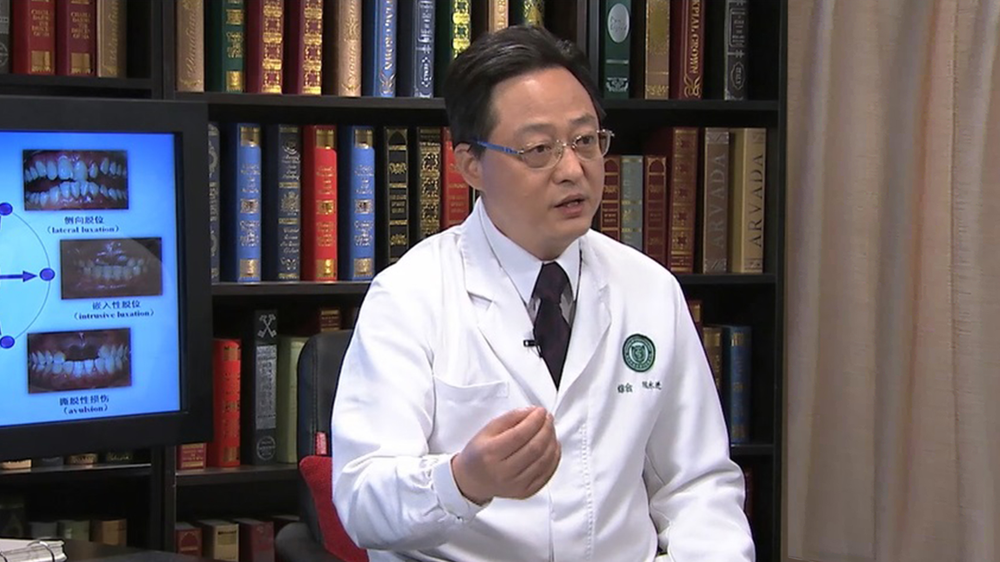

# 成人牙外伤

## 陈永进 主任医师

第四军医大学口腔医学院急诊与综合临床科主任 主任医师 博士研究生导师；

中华口腔医学会口腔急诊专业委员会主任委员；中华口腔医学会全科专业委员会常委；中华口腔医学会理事；国际牙医师学院院士；国际牙外伤协会专家组成员；陕西省口腔医学会副会长兼秘书长；《中华口腔医学杂志》编委；《中国口腔医学继续教育杂志》编委；《实用口腔医学杂志》编委；《牙体牙髓牙周病学杂志》编委；《口腔疾病防治》等杂志编委。

**主要成就：** 获中国人民解放军军队院校育才金奖；“创新型口腔医学本科生临床综合实习教学体系的构建与实践”陕西省2015年高等教育成果奖特等奖；“心理应激对口颌系统的负性效应、影响机理及其防治策略研究”获2016年中华口腔医学会科技奖一等奖；获得国家发明专利2项、新型实用专利4项；发表学术论文82篇，其中SCI/EI论文33篇，临床教学文章20篇

**专业特长：** 主要研究方向为应激对口颌系统功能及结构影响、机制以及对抗策略，牙外伤愈合机理与规范化治疗的研究；擅长牙科疑难疾病综合诊治，牙外伤的规范化治疗，颞下颌关节紊乱病及磨牙症的诊治。

## 成人牙外伤都有哪些类型？

牙外伤是最常见的口腔颌面部外伤之一，牙外伤有很多分类，目前都遵循国际牙外伤协会的分类，一般我们将牙外伤分为牙及牙槽骨损伤，牙脱位性损伤，以及牙撕脱性损伤，三种类型，在这三种类型中还有一些亚型的分类。

大家看看这张图，属于牙及牙槽骨的损伤，在这一类损伤中我们又分为一些细小的类型，比如说简单牙冠折、复杂牙冠折，还有冠根折、根折，很多类型。

我们从这个图上看的釉质损伤、釉质折断、釉牙本质折断，是比较轻的一种类型，复杂冠折是比较严重的类型，什么叫简单冠折？简单牙冠折就是牙神经没有暴露，从专业上来讲就是牙髓没有暴露，大家看这个红点就是牙髓暴露出来了，凡是牙髓暴露的我们称之为复杂冠折。

如果牙齿折断以后缺损的牙体组织不光涉及到牙冠，还涉及到一部分牙根部分折掉，我们称之为冠根折，冠根折这也分两种类型，一种类型牙髓暴露，一种类型牙髓没有暴露，没有暴露的我们叫简单冠根折，暴露以后称之为复杂性冠根折。

还有一类就是牙根折，表面看牙冠是好的，但实际上牙根已经折断了，称之为牙根折，这就牙齿损伤的一个分类。

牙槽骨损伤又分为几个小分类，牙槽骨折裂包括牙槽窝碎裂，牙槽骨骨壁折裂，以及牙槽突折裂，当然这些分类都是医学上专业分类。

牙齿外伤不光是牙齿本身的损伤，也可能损伤了它的支持组织，包括牙周组织，根据这些损伤我们又一种分类，涉及到牙周组织损伤的我们叫牙齿脱位性损伤，脱位性损伤又分了很多类型，包括牙齿震荡、牙齿半脱位、牙齿脱出性脱位、牙齿特向脱位、嵌入性脱位这几类。

牙齿震荡比如说我们吃东西的时候咬到硬物，本身有的人会感觉一过性的牙齿疼痛，也可能持续几天，其实牙齿没有松动，也没有出血，也没有移位，我们称之为牙齿震荡。

有的牙齿受到外伤以后，包括外力、运动，可能出现牙齿松动，但是牙齿没有明显移位，临床我们经常看见的就是牙龈有些渗血，这一类我们叫半脱位，半脱位实际上是没有脱位的，只是有松动。

第三就是脱出性脱位，突出性脱位意味着牙齿向外脱出了，也就是说牙齿偏离了它原来在牙槽窝内的位置，不光有疼痛、松动，还有位置的变化，往往一般都是向下脱出来，这一类叫侧向脱位。

侧向脱位最常见的向内侧，叫向舌腭向脱位，往往是外力打击的时候，还有磕到的时候，交通摔伤的时候最常见，这个牙齿它的移位不是垂直向下，它可能向内侧，也可能向外侧，可能向侧方，我们叫侧向脱位。

还有一种不是向外脱位，它向牙槽窝里边嵌入进去了，就是摔伤以后牙齿向牙槽窝里边移位了，我们称之为嵌入性脱位。

牙齿外伤有很多分类，最严重的一种就是牙齿掉了，由于外伤造成的牙齿脱落，我们从医学上来叫，国际上统一名词叫撕脱性损伤，它是因为固定牙齿牙周膜被撕脱了，牙齿从牙槽窝里边完全脱落出来了，我们叫撕脱性损伤，这是最严重的，也是预后最不确定的，治疗难度也是最大的一种牙齿损伤，因此可以说牙齿外伤的分类，从医学角度来讲还是比较复杂的。

## 牙齿受到外伤后如何应急处理？要注意什么？

我们国家关于牙外伤知识普及还是不够的，在这里我想给广大患者说牙外伤以后，首先第一个要重视，第二是及时去专科医院就诊，因为牙外伤治疗专业性比较强，患者受到牙外伤最主要的要注意几点：

发生牙外伤以后患者到医院之前，注意的几个事项，比如保持面部清洁，往往都是摔伤的，迅速清理面部口腔沾染的污物，保持面部口腔清洁，避免二次污染，这是第一个要注意的。

第二个就是要注意口腔清洁，牙齿外伤往往出现牙髓暴露，这个时候有的人出血会含冰止血，但牙髓是最容易受刺激的，所以注意保护牙髓，保护口腔的清洁，这也是很重要的。

其次注意脱落的牙齿以及破损的牙齿要注意保存，这个很重要，比如牙齿完全脱落以后，一定及时的用流水，自来水也可以，用流水进行冲洗，把表面污物冲掉，尽快到医院去。

到医院去的过程中，牙齿的保存也很重要，经常在临床上看到一些患者，用卫生纸、报纸包裹着脱落的牙齿，放到杯子里包着的，有的人还把牙齿刮得干干净净，牙齿最好用牛奶保存送到医院来，这是最重要的，或者把它含在口腔里边。

关于这个问题是有研究的，国内国外都做过实验，把脱落的牙齿放在牛奶里边，把它放在生理盐水里边，或者把它干燥保存，结果是这样的，牙齿脱落以后在牙根部有很多残留的牙周膜细胞，牙周膜细胞生存是要有一定生理环境的，实验证实放在牛奶里边，细胞可以存活两小时，如果放在婴幼儿奶粉里面，时间还会更长一点，婴幼儿奶粉有很多营养因子。

如果没有条件的话，我们把它放在口腔里边，因为口腔唾液环境更适合本人，相对牛奶来讲保存时间还是要短一些。

国外还有一些商品化的保存液，根据细胞生长所必需的生长因子和各种条件制成的商品化的保存液，放在学校里边，当小孩、学生牙外伤以后马上冲洗，放进保存液里送到医院。

我们国家目前还没有商品化保存液，但是经过实验我们推荐大家，放在牛奶里面是最合适的，同时我们还要注意给提醒一下，不要像刚才所说的，有的家长为了医生方便，把牙齿刮得干干净净，实际上把牙齿上残留的细胞刮掉了，一定要冲洗好，放在湿性环境下，牛奶或者唾液，实在不行生理盐水也可以，但是绝对不能干燥状态下送到医院，同时注意一点，时间越快越好，这也是有实验依据的。

我们把动物的牙齿拔下来，五分钟内再植进去，成功率95%以上，超过半个小时牙周膜细胞死的就很多了，超过一个小时大部分的牙周膜细胞就死掉了，所以再植入成功率就大大降低，超过两小时百分之百的基本都不能成活了，所以采用合适的保存方法，尽快找医生进行处理，这是最好的。

条件允许，有的流水冲洗以后自己都可以再植进去，有一个患者踢足球时候把牙齿踢掉了，然后自来水一冲，自己放进去了，然后到医院进行固定，长好了，十几年牙齿都是好好的。

（采访）牙外伤到医院后需要做什么检查吗？

到了医院以后，一般来讲医生首先会问摔伤或者损伤的原因是什么，不同原因造成的后果可能是有差异的。第二现在的症状是什么样的，第三要对牙齿进行一些检查，一般来讲医生检查牙齿时会检查全身状况，因为这往往涉及到交通，还有体育锻炼以及暴力性的东西，有没有颅脑的损伤，有没有全身其它更重要部位的损伤，医生会把它排除掉，如果这些都没有问题了，才会对这个牙齿进行详细的检查。

检查包括牙齿疼痛情况，包括牙齿松动情况，包括牙齿有没有移位，包括牙龈有没有出血，包括有没有伴随着其它的损伤，医生会拍一个X光片，拍个牙片，看看牙根情况怎么样，牙槽骨情况怎么样，这一系列的检查，这些检查一定是在正规医院才可能做到。

## 牙齿受到撞击后没有松动、移位，还需要治疗吗？

这个就是牙震荡情况，牙震荡情况属于牙周膜性损伤，或者叫牙齿撕脱性损伤最轻的一种，对于这一类损伤，如果说没有牙龈出血，没牙齿松动，也没有移位，就是有些疼痛不适，有些叩痛，可以进行观察，让患者在短期的不要用这个牙齿吃东西，这是一个。

第二避免咬合创伤，第三，保持口腔的清洁，然后观察两周、四周，一个月、两个月、三个月。

一般观察半年的时间，因为牙齿震荡以后预后具有不确定性，可能现在看着没事，过一段时间它可能就出现牙髓坏死，这个是有病例的，刚开始一看好好的，过一段时间出现牙髓神经的坏死，所以观察和避免再创伤，保持口腔清洁是最重要的几条，可以暂时不处理。

## 牙齿受外伤后松动了应如何处理？需要拔牙吗？

牙齿受到撞击后松动也是分情况的，看松动情况严重与不严重，在临床上又分为一度松动、二度松动、三度松动。

一般来讲，轻度松动我们也称之为一度松动，比如说有一个方向的运动，唇舌向的运动，或者颊舌向的运动，称之为一度松动。

如果有两个方向的运动，基本上都是二度松动，松动度更大了我们就可能称为三度松动，或者我们叫重度松动，是这样一个分类方法。

牙齿有松动一定要注意尽快去就诊，医生会根据情况决定是进行固定还是决定暂时不固定，或者可以戴一个牙弓的咬合板，用咬合板相对固定一下，可以进行观察，一度松动基本上就可以这样做，如果出现二度以上的松动，就要对牙齿采用固定的措施，减少进一步创伤。

（采访）牙齿松动了是不是该拔掉，什么样情况下要拔掉？

首先医学发展到现在，各种先进技术先，进治疗方法都有，首先医生的原则是尽量不拔牙，这是治疗原则，尽量不拔牙不等于所有牙不能拔。

如果说牙齿松动到二度，甚至三度，一般通过固定措施让它固定起来，如果说牙齿松动了很多，并且牙齿本身有一些疾病，比如说严重的牙周炎，牙槽骨的吸收了，明显这个牙齿是保不住的，这个可能我们要拔掉，同时如果这个牙齿损伤缺损的太大了，缺损到牙槽骨之下了，这类的外伤牙齿有的确实也保不住的时候，我们也要考虑拔，但是原则是尽量保存牙齿。

## 牙齿外伤后出现裂纹，该如何治疗？

牙齿裂纹实际上我们叫牙釉质损伤，牙釉质损伤是最轻的一种牙体组织损伤，这一类损伤有的不用治疗，有的患者会有感觉但还看不出来。
一般临床医生会用一个垂直光源从舌侧照一下，然后从唇侧可以看到一些隐形裂纹，这一类情况有的可以不管它。

第二我们有一些流动树脂，有些新的材料可以把表面覆盖一下，避免一些外界污染物进入到牙本质里边去，通过牙本质小管再影响到牙齿，所以我们可以用流动树脂表面进行处理，或者说一些粘接剂，涂一层粘接剂来保护牙齿，这样就可以了。

## 牙齿外伤磕掉一块牙齿，应如何修复？

牙釉质折裂或者牙釉质和牙本质都折裂了，就是简单的牙冠折，这类情况我们也是根据具体情况来定。

第一脱落损伤的牙体组织还在不在，完整不完整，如果比较完整，现在新技术和材料都可以把它粘接回去，通过粘接的方法把它恢复了，现在患者对这一点还是比较受欢迎，因为自己的东西粘回去他比较愿意，这是一个。

第二如果牙体组织已经碎了，无法粘接了，我们可以用一些树脂材料进行修复，一些牙齿损伤太大，靠近牙髓，我们还对牙髓进行一些保护措施，保护完以后再进行粘接，再进行修复。

还有一部分是牙髓都暴露了，还有切髓术或者说去髓术，或者说其它一些盖髓术的一些方法，在这基础上把牙冠粘上去也好，树脂修复也好，有很多的方法。

还有就是修复完了以后，大面积缺损的时候，可以考虑用一个牙冠，就是人工的牙冠在外边再保护一下，可以采取这些方法。

## 牙外伤后牙根受损会有哪些症状？牙根折断后一定要拔除患牙吗？

牙根受损在临床上，第一有可能出现牙齿松动，有可能出现牙齿移位，但是这些也有可能不出现，当然牙齿一些疼痛的症状，比如叩痛，这一般都是有的，可能松动症状也有的，移位的情况也有的，有的情况没有明显移位的时候，单纯从临床上有时候不一定能完全确定，所以拍一张牙片非常重要，能判断牙槽骨里的牙根有没有根折，所以这个拍个牙片非常重要。

（采访）牙根折断应该怎么治疗，牙根折断必须得拔除吗？

这个问题非常好，关于牙根折断的问题，很多患者包括相当一部分医生、口腔科医生，以为牙根折断就要拔牙，实际上现在随着新技术发展，很多牙根折裂、牙根折情况不需要拔牙。

我们现在把牙根折大致上分为三种类型，一种是牙根尖1/3折，牙根尖折，一种叫根中折，还有一种叫根颈部折，叫根颈折，这三类情况预后是不一样的。

根尖折它的预后是最好的，根尖折和根中折的这一部分患者，保存牙齿的几率比较高，但根颈部折治疗的失败率是比较高的，治疗的过程中需要固定的时间也是不一样的，根颈部折固定时间要长一些。

## 牙外伤导致的牙齿折断，要马上进行根管治疗吗？

这个问题目前临床上不同医生有不同的看法，但是根据最新的一些研究和国际牙外伤协会指南，关于根管治疗时机问题，目前主张先观察再进行根管治疗，除非很明确这个牙齿牙髓保不住了，并且牙根尖已经发育完成的这种患者，就要进行根管牙髓的治疗，是不是需要马上进行根管治疗。

我们有很多判断条件，比如损伤程度，牙髓有无暴露，牙齿发育情况如何，也就是说患者年龄大小，咬合关系怎么样，我们需不需要立刻进行修复，这是一系列的判断因素。

但是有一点需要提醒，在临床发现对于一些年轻恒牙外伤以后，当时测定牙髓的时候它没有活力，按照一般判断的话，没有活力就认为牙髓已经坏死，就马上进行根管治疗的，但实际上可能再过一段时间又恢复了，称之为休克期。

因此对年轻的恒牙，特别是青少年，我们在判断牙髓的时候，一定要注意定期观察，一般观察三个月，这个可能自然就恢复活力了，就不需要去做根管治疗了，确实坏死我们就要做根管治疗。

这个情况判断的话，比如牙震荡，还有牙釉质折裂，釉牙本质的折裂，特别是牙髓没有暴露情况的情况下，判断要特别慎重。

现在临床对牙髓的治疗，先观察一段时间，定期复查，每次复查查一查牙髓活力情况，确认牙髓不能再恢复，我们再做根管治疗，在急诊的时候可以不需要马上做，这是我们现在一个最新的观点。

## 牙外伤导致的牙齿位移，还能复原吗？

牙齿位移是指牙齿离开了原来在牙槽窝的正常位置，在临床治疗的过程中，其中的一个目的就是要恢复它在原来的位置，通过医生操作是可以做到的。

（采访）根据牙齿移位轻重程度来进行固定，是如何固定的？

固定的方法实际上也是发展了很多年，以前我们是仿照牙槽骨骨折的外科固定方法，叫牙弓夹板固定，后来发现这个固定完以后，牙齿和牙槽骨之间的愈合状况不是太好，有的会出现牙固连情况。

经过多年发展，普遍认为牙齿固定采取一种弹性的或者半弹性的方法固定，包括现在发展的高弹纤维固定，还有一个钛链的固定，这种固定方式比较符合牙齿的生理状况。

大家看这个图，我们称之为非弹性固定，实际上就是钢丝牙弓夹板，这一块我们叫牙弓夹板，上面用钢丝进行固定，最常用的是口腔颌面外科用颌骨骨折后的固定，又叫坚固固定，固定后牙齿是没有动度的，骨折的固定要求对位比较好，要求恢复良好的咬合关系，所谓固定是坚固固定，牙齿没有动度，在临床有一种情况叫牙固连，也就是牙齿愈合方式不是生理性的愈合方式，出现牙齿和牙槽骨之间骨性粘连，出现这样一个情况。

所以近几年这个方法几乎已经不用了，改名叫弹性或者半弹性固定，所谓弹性半弹性固定，就是我们固定用的东西允许牙齿有一定的动度，比如说钛链，钛链是软的，一节一节之间是可以变形的，比如说这个纤维夹板，它也是软的，在上面涂上树脂以后固化变硬了，但是它不是全部，它都是几个点，这个我们刚才讲的是坚固固定，也就是非弹性固定的，对牙齿的愈合是不利的。

现在从国际上来讲，我们主张的是叫弹性或者半弹性固定，主要目的就是允许牙齿固定的过程中有一些轻微生理性动度，这是我们主要的目的，实验已经证明这种生理性动度更有利于牙齿在牙槽窝中的愈合，并且更有利于接近生理性愈合。

钛链它是有几个点，通过树脂粘接，有些弹性，可以弯曲变形，还有一个高弹纤维夹板，把它敷在牙面上以后，通过几个点进行固定粘接，也是允许牙齿有一定的动度，已经证明可以减少替代性吸收，并且有利于牙周组织改建，而且保持牙齿生理性动度，更有利于牙齿愈合，牙周愈合。

（采访）固定需要多长时间？

这又是一个新的理念，曾经一个患者固定了半年，拆掉以后底牙就掉了，实际上不是说固定时间越长，固定效果越好，通过临床实验和观察已经确定，一般来讲固定时间两个星期就够了，有的需要固定时间长一点，固定四个星期，牙根颈部折固定时间要长一些，最长可以固定到四个月，一般来讲不需要固定那么长时间，对于牙齿固定的时间，医生会根据情况来确定，2到4周是最常见的。

（采访）如果固定时间超出规定时间，超出牙齿所能承受的时间之外，会有什么样的危害吗？

固定时间长，首先损伤牙齿自然愈合过程，跟自然愈合过程不一样，做手术以后都会愈合，七天到九天拆线，没有几个月拆线的，固定以后牙齿动度首先是受到影响的，第二个固定时间长，对口腔卫生各方面都是有影响的，第三对其它牙齿它也是有影响的。

## 牙外伤导致牙齿脱落，可以即刻种植吗？

即刻种植首先它不是自己的牙齿了，我们用的是种植体，现在最常见的口腔修复方案就是叫种植体。

即刻种植有很多条件限制，比如牙槽窝不能有很明确的损伤，牙槽窝损伤很厉害，原来这个牙齿在这个地方有没有明显的炎症，原来牙齿所在的牙槽窝周边的牙槽骨，它的骨量是否能够满足种植体的包裹，能够把种植体包裹好，颊舌侧或者唇舌侧的牙槽骨的厚度，牙槽骨的高度，牙槽骨的密度，是否适合进行即刻种植。

所以即刻种植大部分种植学专家持一个审慎的态度，但也有一部分专家报道他们的即刻种植效果很好，这个要求找有经验的医生来看最好。

## 对于牙外伤，我们要知道哪些事？

牙外伤是口腔比较多的外伤情况，医院急诊牙外伤的发生率从十年前的排名第四位，到五年前的第三位，到目前口腔医院急诊牙外伤占急诊第一位了，说明近几年牙外伤的发生是在增多。

第二，人们对牙外伤也比较重视，牙外伤就诊过程中要注意一些宣传，还有牙外伤知识的普及，特别是预防和发生牙外伤以后大众的处理。

第三，对于口腔牙科医生现代治疗理念普及，规范治疗方法的推广，这个特别重要，治疗方法不一样和不规范，直接导致牙外伤预后不好。

第四，牙外伤特别是青少年，是家人都非常关心的，也是容易发生医患纠纷的急诊情况，对于牙外伤预后的不确定性，牙外伤治疗需要定期复查，医患沟通一定要做好，医生一定给患者讲清楚，牙外伤治疗，要从两个方面来去看这个问题：

首先从患者角度，首先普及牙外伤危害知识，让人们特别是青少年重视这个问题。

第二，比如在上体育课的时候，体育运动的时候做一些保护，可以做一些牙套进行口腔保护，大家知道打拳击的时候，很多人都戴了牙套，实际上它也是一种保护措施，还有打篮球、美式橄榄球，都是有些保护的，中国不太重视这个东西，我们可以普及知识，进行体育运动的时候进行一些保护措施。

如果出现牙外伤以后，要注意避免二次损伤，不要喝过冷的水、过热的水，不要再粘污染的环境，要及时到医院去，同时如果有牙齿脱落把它保护好送到医院去，到了医院去以后医生会进行一些详细的检查治疗。

很多患者要注意这一点，医生让你定期复查，一定要按照医生说的复查时间来进行复查，因为牙齿外伤有一个很大的特点，治疗预后的不确定性，感觉牙齿损伤的不严重，但是最后出现牙髓坏死、牙齿松动，医生要给患者讲清楚，进行详细的检查，然后确定治疗方案，同时告知患者定期复查的重要性。

## 牙外伤导致牙齿脱落，就诊前应如何保存脱落的牙齿？

临床上我们经常看见一些情况，患者牙齿掉了，拿到手里过来就诊，有的用的这个卫生纸包着过来的，也有用报纸包着过来的，也有棉花包着过来的，普遍存在的问题是干性过来的，当然还有存在的问题，有的患者的家属为了给医生不增加麻烦，自己捡到以后洗的干干净净的，把牙根刮得干干净净的，这些都是不准确的。

脱落的牙齿一定要注意保存的方法，为什么？主要是脱落的牙齿它的牙根部还有很多残留的牙周膜细胞，这些细胞对于把牙齿再植到牙槽窝里生长非常有用，为了保存细胞活性，国内国际都有很多实验证实牛奶是一个很好的保存介质。

保存介质分为两种，一种是天然的保存介质，一种叫人工保存介质，天然保存介质包括唾液、牛奶，包括植物提取液，很多很多，实验发现最方便保存，也比较好的就是牛奶，如果没有牛奶，把它放在嘴里边唾液保存，也是比较好的。

还有一种就是人工保存介质，包括一些平衡液，细胞培养液和商品化的保存液，国外有很多，目前国内还没有这一类的保存液。国外在一些学校里面放有很多商品化保存液，以便学生出现外伤的情况下保存牙齿。

第二就是牙齿的保护，一定不要把牙根上面的东西刮的干干净净，把细胞都刮走了，细胞已经刮掉了，细胞对牙齿再植有很重要的作用，冲洗好放在牛奶或者唾液，或者以后可能会出现的商品保存液里边，尽快到医院救治，这是我们要注意的。

## 老年人咬硬物导致牙齿折断，应如何治疗？

临床上这种情况也不少见，有些老年人往往牙颈部本身异常，往往可能有颈部的一些缺损，或者龋齿，在咀嚼硬物的过程中就会出现牙齿的折裂，有部分可能就是牙冠折掉了，有一部分折的位置就靠近牙冠和牙颈部这个情况，所以情况是多种多样的。

如果余留的牙冠部分比较多，我们通过修复的方法来治疗，如果余留的牙冠不多了，牙齿本身有一些龋坏，这个牙冠我们就不能保留了，我们可以做根管治疗，根管治疗做了以后还要打个桩，然后用树脂修复，修复完了在外面做个冠，把它保护起来，采取这样一种方法。根据折裂范围大小，折裂部位，以及牙根本身健康情况，牙槽骨的健康情况。

另外有没有根尖周炎症，同时患者本身的意愿是什么，也很重要，结合患者的意愿，所以不同情况医生会进行分析，制定出相对应的治疗方案。

## 牙外伤导致牙齿折裂，患牙还能保留吗？

这个情况也是比较复杂的，治疗原则是尽可能保存患牙，但是不同的牙外伤情况治疗方法是不同的，比如范围比较小的损伤，用树脂修复就行了，损伤比较大就要考虑树脂修复以后，可以做一个烤瓷冠或者其它一些冠来保护起来。

对于是不是要拔牙，这个完全决定于患者的损伤程度，比如损伤的牙齿折裂到牙槽骨四个毫米以下了，治疗非常困难，第二牙周状况又不好，或者说本身又有炎症，有一些龋坏或者其它问题，保留价值不大的时候，我们这时候才考虑拔牙的问题，在拔牙前我们先考虑怎么去治疗，具体情况具体分析吧。
