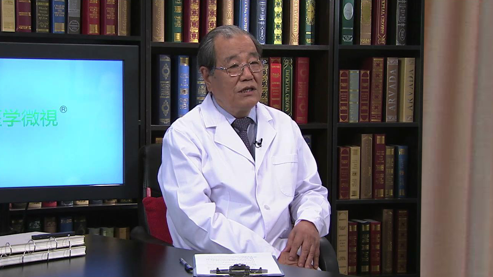

大众口腔健康教育
================

--------------

王兴 主任医师
-------------

   1678538204272

北京大学口腔医学院颌面外科主任医师 博士生导师；

中华口腔医学会名誉会长；中华医学会名誉理事；中国医师协会副会长；中国科学技术协会九届荣誉委员；国际牙科研究会会员；国际牙医师学院院士；《中华口腔医学杂志》名誉总编。

**主要成就：**
1992年获国家教委、国务院学位办授予的“做出突出贡献的中国博士学位获得者”称号；2001年获首届中华医学科技奖一等奖；2001年所负责的课题“内置式颌骨牵引成骨的临床和实验研究”被评为“九五”期间我国重大科技进展项目；2008年获中华医学会中华系列杂志优秀主编奖；2010年获中华医学科技二等奖；2014获中华口腔医学会科技奖一等奖；2016年获邱蔚六口腔颌面外科发展基金“华佗奖”；先后主编专著11部，参编22部，在国内外学术期刊发表学术论文228篇。

**专业特长：** 擅长种植外科、正颌外科、创伤外科。

--------------

怎样的“口腔”才算是健康的口腔？
------------------------------

什么叫口腔健康？口腔健康的定义是什么？我们首先得搞清楚究竟有哪些疾病，可能影响到口腔健康。

我大概把它分了一下，可能有八大类的疾病。

第一、我们所说的虫牙，医学上叫龋病，龋齿。

第二、牙周炎，牙周病。

第三、牙掉了，缺牙了，甚至没有牙齿了。

第四、口腔颌面部的各种肿瘤，全身所有的肿瘤都可以长到这个地方来，同时这个地方还有两类肿瘤是全身没有的，一个叫做牙源性的肿瘤，还有一个是唾液腺来源的肿瘤，全身其它地方没有牙齿，就没有牙齿来源的肿瘤，其它地方没有唾液腺组织，就没有唾液腺来源的肿瘤，所以口腔颌面肿瘤也是一大类疾病。

现在社会创伤越来越多，我们全身都是有保护的，唯独牙齿这一块是露着的，所以在工伤，在车祸里边，口腔颌面部的创伤非常多，严重的可以破坏咱们的口腔功能。

同时还有各种各样的炎症，这些炎症在口腔颌面部就非常危险，因为常常导致，我们叫做弥漫性的，多部位的蜂窝组织炎，这疾病也是要命的。

还有一大类的疾病就是我们各种各样先天的，后天的畸形，这些畸形有的非常严重，也会危及到患者生命安全，有的呢严重影响患者容貌，对这些人的社会生活，你比如说就业，升学，这个都会造成很大的影响。

最后一类还有各种各样的神经系统的问题，比如说三叉神经疼，比如说面神经麻痹、面瘫，这些都是属于口腔颌面部的疾病，都可以说是口腔的疾病。

如果没有这些疾病，那我们口腔就是健康的，如果有这些疾病中间的任何一种都不行，都会严重地影响着口腔颌面系统的功能。

那么下面我们就介绍一下口腔颌面系统的功能：

第一，老百姓说起来就是吃东西嘛，没有别的，其实是不对的，吃东西是一种。

第二，说话也是，非常重要，没有口腔说不了话的。

第三，呼吸，如果口腔这一块出了问题，会严重影响到正常人呼吸，人活一口气嘛，没有这口气是不行的。

还有我们容貌，大家过去不重视，只觉得中国人单眼皮、低鼻梁可能影响容貌，却不知道口腔颌面部这一块，对容貌的影响非常大，特别是牙齿，如果这个牙齿不整齐，里出外进，或者是有各种各样的疾病，比如牙周病，牙根暴露或者大齿龅牙等等，那么都会影响到容貌。

还有一些比如说恶心了，要吐一口，如果口腔有毛病就吐不出来，把人憋死了。

还有各种各样的艺术表演里边，管弦乐，吹奏乐器，这些吹奏乐器没有口腔也不行的。

所以口腔的功能是一个多方面的，当然重要的是吃东西，民以食为天，如果吃不了东西，就这一条，对人的生活就有很大的影响。

--------------

哪两类口腔疾病危害到全世界90%的人？
-----------------------------------

龋病，牙周炎这两类疾病，几乎是全人类的疾病，因为全世界90%的人都有这样的毛病，或轻、或重、或多、或少，都会有龋病或者是牙周炎，而这些病是怎么引起的呢？

我们肉眼是看不见的，如果在显微镜下，我们所谓干净的牙齿表面，会有各种各样的致病细菌，我们叫病原微生物，在口腔这个环境里面，温度、湿度、营养条件都非常适合它生长，大量的繁殖生长，而且一天24小时从来不停止。这些细菌和它的代谢毒素跑到哪里去了？跑到肚子里去了，跑到心血管里边去了，而这些都会引起很多的问题。

所以像这样的情况，我们就知道了造成这些口腔疾病的原因，这些细菌会不断的腐蚀我们的牙齿，会使牙齿脱矿，就是长虫牙，同时也会破坏牙周的组织，造成牙周的炎症，那么这些牙周的炎症，龋病，它都会有一些临床表现。

老百姓说“牙病不算病，疼起要人命”，主要是讲的龋病，龋病开始没有症状的，患者也不知道，也不觉察，只有深入到牙髓才知道，我们叫牙髓炎，甚至到了根尖，牙根的底下，就造成根尖周围炎。

牙髓炎的疼痛常常是要命的，甚至患者有轻生感，不想活了，脑袋往墙上撞，原因是什么？太疼了，太疼的原因是整个炎症不能释放，它在牙髓腔周围是那么坚硬的壳，压力非常大，对神经的刺激非常强烈，所以才疼痛非常厉害。

有了牙周病，牙龈炎，牙龈就会有出血。有的患者说，我经常一刷牙就出血，什么原因？牙龈炎，同时还会有一些疼痛，牙龈红肿，牙周有结石。这个结石，老百姓可能不太理解，就像烧水的水壶一样，时间长了以后有水碱，牙齿周围也会有一些矿物质的沉积，造成牙结石，而这些牙结石又非常容易被菌斑附着，就是细菌附着在牙齿表面，不断刺激和破坏牙周的组织。

这种结果时间长了以后，还会造成牙床子的不断吸收，牙龈萎缩，牙槽骨的萎缩，最后导致牙齿脱落。

牙齿脱落，没有牙齿，咱们中国人看得很淡，就觉得老年人自然而然就应该没有牙齿，但实际上不是，在国际上，大家认为如果一颗牙齿都没有的话，应该把他看作残疾人。因为任何器官缺失都是残疾人，咀嚼器官就是牙齿，这个牙齿一颗都没有了，咀嚼器官丧失了，这么一个很重要的器官丧失，为什么不作为残疾人对待呢？

所以在国际上，大家把它看得很重，而我们看得比较坦然，觉得28颗，32颗牙齿，掉1颗、2颗有什么关系，甚至说全口掉了，人老了嘛，自然而然就应该没有牙齿，这些看法都是不对的。

另外就是要看到这些疾病的发病率很高，尤其是龋病，牙周炎，牙周病，几乎是危害到全人类。

--------------

两类不及早治疗会致命的口腔颌面部疾病！
--------------------------------------

说到口腔颌面部肿瘤，这个大家可能不太了解。口腔颌面部这个部位，什么瘤子都可以长，癌，肉瘤，血管、淋巴管的各种肿瘤，都可以长在这个地方。

同时这个地方还有两类特殊的肿瘤，就是牙源性肿瘤，还有唾液腺来源的肿瘤，而这两个肿瘤在全身其它部位不可能长，而且在一些国家的发病率也很高，比如说在一些地方有嚼食槟榔的习惯，咱们国家的台湾，湖南、海南，还有印度，都有这个问题，而这些地方口腔癌的发病率很高。

口腔癌如果早期治疗效果还可以，如果发现得晚了，甚至转移了，那就要命了，所以肿瘤也是我们不可轻视的一个很重要的环节，要预防口腔癌。

另外还有口腔的各种各样的炎症，这个炎症可能老百姓看到的比较少，但是有一个炎症，大家可能很经常遇到，就是阻生智齿。常会听到医生一检查说有智齿冠周炎，我本人就亲自处理过这样的患者，因为智齿冠周炎而导致咽颊部，整个口底的蜂窝织炎，最后抢救了九天九夜都没抢救过来，患者也走了。

所以像这样的一类炎症，现在也有点回头的势头，为什么呢？抗菌素滥用。过去我们把它控制得很好，这些炎症基本上在早期都可以处理得很好，但是现在滥用抗菌素，细菌产生了抗药性，最近这几年口腔颌面部的炎症感染性疾病，又有回升的苗头。

--------------

口腔颌面部畸形有哪些？会有哪些危害？
------------------------------------

口腔颌面部的畸形有长得过分的，比如说常说的大下巴，下颌前突，这些患者牙齿都对不上的，对容貌有很大的影响。

还有下巴根本没有发育的，下颌骨没有发育的，而没有发育的这类疾病更要命了，它常常影响到他的呼吸道，我们讲有一类疾病叫阻塞性睡眠呼吸暂停低通气综合征。主要有三大症状，白天的极度嗜睡，可能我跟你在这聊天，我就睡着了，我骑着自行车，我撞到大树上去了，我开着车睡着了，非常危险。

同时这样的患者夜间有两大症状，叫憋气、打鼾，打鼾就叫打呼噜，这个打呼噜，大家觉得很习以为常，实际是个疾病，而这些疾病在过去，大家都不认识，是上个世纪70年代末，大家才开始认识到有呼吸睡眠的问题。如果下颌发育不全或者发育过小，都会造成这个问题。

当然还有各种各样的畸形，歪的，斜的或者是外伤，肿瘤切完了以后，这些缺损性的畸形等等。

大家想想，如果我们身上有一个疤痕，穿上衣服别人是看不见的，但是如果颌面部有严重的畸形，会对患者造成什么样的影响？患者的心理，患者的就业，患者的社会交往，患者的婚姻，都可能遇到一些障碍，因为它涉及到容貌，可以完全破坏我们一个正常的容貌结构，所以这也是一个很大的问题。

--------------

牙周炎和糖尿病之间有什么关系？
------------------------------

这个问题最近热得很，大家研究的一个关系，就是牙周病和糖尿病之间的关系，比如说牙龈炎的患者，和正常没有牙龈炎的患者相比，糖尿病本身的患病率就提高了2.1倍，而且重度牙周炎的话，那更厉害了，是3.1倍，和正常人比较，他非常容易得糖尿病。

反过来从糖尿病的治疗这个角度去看，如果说没有处理好牙周炎，糖尿病所有的用药效果，都会受到很大的影响，比如打胰岛素，胰岛素发挥的作用就很有限，牙周炎产生的细菌代谢毒素，会抑制胰岛素作用的发挥。

所以牙周炎的患者，一定在患了糖尿病之后，首先控制好自己的牙周炎，否则治疗效果就很差。预防好牙周炎，我们一方面可以大大的减少糖尿病的发生。另外即使发生了糖尿病，治疗效果也相对比较好，后来有研究证明，对患有糖尿病的牙周炎患者，先把牙周炎控制好，那么治疗糖尿病的药物效果就好得多。

所以有很多内分泌的医生也意识到了这一点，看到有牙周炎的糖尿病患者，先去把牙周炎控制好，再继续用药，否则糖尿病的治疗效果就很差，这是一个国际上研究很热的课题。

我们前几年在北京和哈佛大学中华口腔医学会，连续两次合作举办过这样一个专题的学术会议，就是牙周炎和糖尿病的关系，把国际上最新的研究成果拿到中国来交流，使我们对这个问题的认识就进一步深化了。

应该说在此之前，我们大家几乎不了解，牙周炎和糖尿病有什么关系，大家想都想不到，原来关系这么密切，不仅是发病率的问题，同时也涉及到它的治疗效果。

--------------

牙周炎会导致心脑血管疾病吗？
----------------------------

牙周炎和心脑血管病之间关系也非常密切，比如冠心病，动脉里面有了斑块，造成了心脑血管系统很多要命的疾病，这病是要死人的。现在很多研究证明，它的细菌来源于牙周炎。

比如说国际上研究证明，我们正常人和牙周炎患者比较的话，牙周炎患者患心脑血管病的比例，大概是正常人的1.4倍，要高出一半以上，同时脑中风，这里边有脑梗塞，脑出血等等各种各样的问题，牙周炎患者是正常人的2.1倍。

所以现在国际上搞心脑血管病的医生都清楚了一点，牙周炎是独立发病因素，能把它看作一个独立发病因素，那是很严重的问题，不是一般的问题。

所以大家想要心脑血管健康，首先得保证口腔健康，没有牙周炎才行，而且大家也认为就是说，如果尽早地对牙周疾病进行治疗，进行干预，可以有效地预防心脑血管病的发生，这个关系也是非常明确。

--------------

口腔不健康会引起吸入性肺炎吗？
------------------------------

说起来吸入性肺炎，特别是老年人的吸入性肺炎，特别是住院患者的吸入性肺炎，80%是由口腔细菌引起的，特别是患者住院的时候要插管，管子从口腔插到气管里边去，引起吸入性肺炎，也有叫机械性肺炎的，而这一类的肺炎，100%的细菌是口腔的细菌带去的。

所以现在国内有很著名的呼吸内科专家，他对患者说就先洁洁牙，先弄干净，否则万一插管的时候全是吸入性肺炎，而吸入性肺炎对老年人来说是致命的，很多老年人最后导致死亡的原因就是肺炎，抢救起来成功率很低。

所以也要清醒意识到口腔环境的问题，如果是健康的，干净的，那是非常非常好的，如果是有病的，各种各样的炎症疾病，那对全身系统是致命的，也是导致这些系统发生疾病的很重要原因。

--------------

口腔健康对消化系统的影响不容小觑！
----------------------------------

我们知道慢性胃炎里边有个很重要的致病菌，叫幽门螺旋杆菌，口腔的幽门螺旋杆菌和它是一样的，同源的，这个同源什么意思呢？我简单说一点，就是很多这个细菌是口腔给人家送过去的，因为嘴和食管连着，和胃连着，如果口腔有这些幽门螺旋杆菌，通过吞咽，通过吃东西，不停地给往里边送，就导致了慢性胃炎。

所以有一个很有名的消化内科专家看见我，就跟我说，你要把你的上口给堵好，你们弄不好，我们底下怎么弄也弄不干净，这病刚治好又犯了，就是因为不断地有这些病菌进入消化系统，导致消化系统的炎症。

最近一个很有意思的研究说，不光是消化系统的慢性炎症，比如说慢性胃炎，包括大肠癌的发病率，都与口腔的病菌有关，说他们的研究证明，口腔本身就可以引起结肠癌，这是哈佛大学研究做的结论，而且还说牙菌斑，牙周炎，可以大大地提高这些癌症患者的死亡率。

我们一般都讲究要提高治愈率，要提高生存率，而不是提高死亡率，但是有这些病菌的存在，它就导致了这些癌症患者的死亡率增加，哈佛大学的结果是增加79%，这个数很高，所以就是说口腔的病菌，对整个消化系统的影响也很严重。

--------------

牙齿缺失多，会得老年痴呆吗？会影响记忆吗？
------------------------------------------

大家都知道牙齿一天不停的这么吃东西，上下碰撞，咀嚼，这是个非常健康的生理刺激，对整个脑功能的发展发育，脑功能的健康，有着非常重要的关系，因为这种刺激的力量会传到脑组织，使脑部的血管正常，使脑的功能区的功能正常。

咱们中国老百姓有句俗话就是说，什么都是越用越发达，不用则退化，就这么个道理。他没有了这种正常的生理功能刺激，他的血管就萎缩，就退化，一些脑的重要功能区的组织就发生退化，就萎缩，所以老年痴呆的发病率就明显增加了。有一项研究是70岁以上的老人，如果牙齿缺少于25颗，那么他发生行动不便这一类疾病，患脑中风的风险要比正常人高出50%。

所以像这样一些研究都证明，口腔的疾病和全身系统性的疾病之间，会有非常重要的关系。

有人跟我说老年人如果牙齿少于20颗，他的记忆力就明显的衰退。我到咱们国家一个省去讲学的时候，碰到了这个省的一位领导干部，他给我讲了一个很生动的例子，说他们家就是这样的情况，他爸爸95岁，一颗牙没有掉，到现在生活能够自理，他妈妈有严重的牙周病，老的时候就一颗牙都没有了，82岁就走了，而他本人遗传了妈妈的牙周病，所以他就知道，这个牙齿不好好保护不行，没有牙齿，连寿命都受到影响。

从这位领导的嘴里，我就知道他自己切身体会到，牙齿健康对人体健康影响非常大，所以他本人每年到口腔医院去洁牙4次，他得把他的牙齿保护好，因为他爸爸是一个非常生动的榜样，95岁一颗牙没掉，生活能够自理，头脑非常清楚，他妈妈82岁就走了。

--------------

牙周炎对孕产妇有哪些危害？
--------------------------

如果在怀孕之前，在怀孕期间，孕妇患有牙周炎的话，这个产妇的流产率，低体重儿和早产儿的发生率就会大大提高，比如说重度牙周炎的孕妇，早产率和低体重儿出生率是正常人的7.5倍，而且孕妇她低体重儿风险度，是健康孕妇的5.28倍，所以这是个非常严重的问题。

另外牙周炎还和流产的发生成正相关的关系，就是说有牙周炎的患者，孩子容易发生低体重，早产，甚至影响孩子智力的发育，脑组织的发育等等，这对一个家庭来说太重要了。

所以我们也要关注到孕妇的口腔健康，不仅是关系到孕妇本人自己，还关系到她出生的小宝宝，这个小宝宝想要健康的话，孕妇在怀孕之前一定要早早地干预自己的口腔健康，要让她没有牙周炎，减少早产低体重儿发生的比例。

--------------

牙齿缺失关系到寿命长短！
------------------------

最近有一个研究很有意思，就是说口腔健康和长寿的关系，在美国进行了长达十多年的一个研究，他对70岁以上的老年人进行观察，说牙齿大部分脱落的人，短期出现行动不便的几率增加了70%。

欧洲2007年完成了一项对几十万人的调查研究，排除了任何其它死亡因素，比如心脑血管病，肿瘤这些因素都排除掉，正常死亡里边相比较牙齿多少的关系，举两个极端的数：

如果一颗牙齿都没有的人，男性的死亡率是70%，女性的死亡率是30%。如果有20多颗牙齿的话，男性的死亡率就从70%降低到22%，女性从30%降低到11%。

这么一比较，牙齿数量对整个人的寿命，都有非常重要的影响，我想这个道理不难理解，没有牙齿了，咀嚼功能就丧失了，全身系统性的各个疾病，发病危险因素也增加了，那么自然而然就威胁了生命健康，威胁了人的寿命。

--------------

我国及国际社会对口腔健康的重视和举措。
--------------------------------------

世界卫生组织WHO，它在列的十条健康标准里边的第八条，就是讲口腔健康的，而且特别具体的讲牙齿健康。这个第八条咋说的呢？就是说牙齿要清洁，没有蛀牙，没有疼痛，牙龈的颜色是正常的，没有出血，当然这个还不包括其它口腔的疾病，仅仅涉及了龋病和牙周病这两条，但实际上口腔疾病里面起码有八条，这个范围更加的广泛一些。

另外2011年联合国有个非传染性疾病的高峰论坛，这个论坛最后的文件里面就指出来，全球有39亿人口患有不同的口腔疾病，包括了龋病，牙周病，缺失牙，口腔癌，唇腭裂等等，而且这几种疾病每年都是以20%的速度在增加。

我们现在生活水平提高了，医疗条件改善了，它应该降低才对。其实不对的，这个龋病与我们吃的东西成分，有非常重要的关系。我们的老祖宗，古猿人吃的食物很粗糙，植物纤维素类的食物很多，几乎没有龋病，考古资料发现里面就看不到龋病。

随着生活水平越来越高，含糖的食物越来越增加，吃的东西越来越细腻，对口腔菌斑的发生非常有利，反倒使它们的生存条件极大地提高了，改善了，疾病的发病率就增加了，是这个道理。所以我们就知道，像这一类口腔疾病的发展，并不随着社会的进步而减少，而是有可能不断地在增加。

实际我们也明显的看到，这几年口腔医学的发展进步，大众口腔健康教育，每年有9月20日全国爱牙日，老百姓的口腔保健意识也有提高。但是国家的进步，社会的发展，生活水平的提高，并不意味着某些口腔疾病会减少，这一点我们要清醒的认识，只有意识到这一点，我们才知道该干什么，应该怎么干。

最近比较高兴的就是，看到我们国家制定的《“健康中国2030”规划纲要》，有几个词是涉及到我们口腔的，比如说最近提的全民健康生活方式行动，这个口号就是三减三健，减什么呢？减盐、减油、减糖，这个减糖主要是说给我们口腔的，减少我们口腔龋病的发生，主要是含糖食物量增加造成的。三健是健康口腔、健康体重、健康骨骼，这第一条就是健康口腔。

有一个专家跟我说，看一个国家进步和文明的程度要去俩地方，那么这个国家实实在在的进步和文明，就摆在你面前了，哪两个地方？一去敬老院，看老年人嘴巴剩下了多少颗，可以行使功能的牙齿。二去幼儿园，看看孩子嘴巴里边的多少个龋洞没有得到治疗，这个国家的进步和文明程度，就实实在在摆在你面前，这个话有一定道理。

--------------

预防口腔疾病，你要怎么做？
--------------------------

不管是口腔医生，还是全社会各个方面，我们大家都要重视口腔健康，都要给大众做口腔健康教育，让老百姓意识到口腔健康非常重要，要养成一些良好的口腔卫生习惯。

比如说我们倡导大家每日至少刷两次牙，咱们一般都这样横着刷嘛，横着刷对牙齿有破坏作用，另外很多地方刷不到，都主张顺着牙齿的方向，从里到外，各个角落，各个部位，咱们前后左右都要把它刷到，至少要达到3分钟时间吧，咱们一般人慌慌张张结束了，这样解决不了问题，要刷就要认真刷，按照正确的方法，顺着牙齿的方向，旋转式地来刷。

使用什么样的牙膏刷牙，比如我们提倡使用含氟牙膏，这个预防龋病显然效果非常好，可以使龋病的发病率降低25%-40%，又简单易行，代价也不是很高，我们何乐而不为呢？

牙刷的问题，一是刷毛要软，二是刷毛的头部要经过机械打磨，是光滑的，仔细放大一看，那个毛头上是圆盾的，而不是齐刷刷的，像咱们剪刀剪过去的那种毛一样。不是的，它要经过专门的设备，去把头上那个毛磨光滑，所以毛软光滑，另外不要太大，刷毛不要太多。

所以又称为保健牙刷，就要具备这么几个条件，主要是软硬度和头部结构是圆盾的，而不是锋利的，锋利的就非常伤牙龈。

另外一条就是我们每个人，都要养成这样一个习惯，定期去做口腔检查，有两个作用，一个作用是如果发现了一些小的问题，很简单，很容易就把它处理掉，比如龋病早期的浅龋，治疗起来极为简单，费用也很低，代价很小，花的时间也很少。

另一个作用是如果等到牙疼得要命的时候，麻烦就大了，一次两次治不好，要做根管治疗，要做根管充填，费用也很大，一颗牙也得花个一两千块钱，两三千块钱，这个对老百姓来说还是个很大的负担，所以小病要早治疗，无病要预防，每年至少做两次洁治。

我到农村去的时候，一些老百姓说，你们洁牙不行，我原来牙齿长得密密的，我一洁牙走风漏气，什么原因呢？他原来这个牙石，就跟我们的水壶烧的水碱似的，都糊满了，把那个东西给抠掉了，他以为把牙齿给他弄掉了一块，所以这个观念很差。

因为牙石糊满了牙齿，那最后这牙破坏得一塌糊涂，牙槽骨都吸收掉了，一动，牙都要掉了，所以这种情况下，我们还是希望大家有个好习惯，每年去洁两次牙齿，因为这牙石是刷不掉的，那么就要请医生帮忙来把它处理掉，预防口腔一系列疾病的发生。

还有老年人，千万不要觉得掉了牙是老年人的特征，人老了，牙自然而然就掉了，是错误的，如果掉了牙齿，尽快尽早的进行修复，把它镶上，如果不镶上会很多很多的问题。

在临床上看到很多极端的情况，我们一个全国著名的专家，最后牙齿，上面咬着下牙床子，下边咬着上边的腭部，我们叫上牙膛子，上膛，吃东西根本就不敢咬，一咬就全咬破了，时间长了就癌变了，很痛苦。

80岁以上的老人，我们提倡要有20颗能行使功能的牙齿，大多数没有，而且我们国家无牙颌的患者，就是一颗牙齿都没有的患者，在老人里边比例很高的，大概占到了10%左右，所以像这些问题就希望老百姓理解它，了解它。

--------------

含氟牙膏到底该拒绝还是提倡？
----------------------------

含氟牙膏坦率的讲，咱们前些年在还网上炒了一段时间，炒什么呢？向氟毒开战，拒绝使用含氟牙膏，这个搞得我们很生气，我们和世界牙科联盟联合在中国搞了两次研讨会，要极力的，尽快的纠正当时这个这股歪风。

这含氟牙膏的使用是国际上推荐的，当然牙膏的加氟是有代价的，也不容易，技术上也有难点。但是含氟牙膏本身它用起来是非常简便容易的。我们总要刷牙，总要用牙膏嘛，那么氟本身是对牙齿的再矿化，保护牙齿硬组织是极有利的因素，是世界卫生组织向全球各国政府推荐的，预防龋病的办法。

我们国家当时就掀起一股反对的风潮，所以后来不得不召开各种各样的研讨会，以正视听，也通过新闻媒体组织专家，来大力宣传和倡导使用含氟牙膏。

--------------
