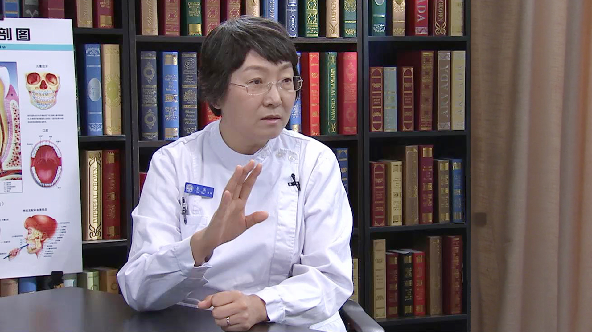

# 12.19 儿童牙外伤//秦满教授

---

## 秦满 主任医师

北京大学口腔医院儿童口腔科主任 教授。

中华口腔医学会儿童口腔专业委员会候任主委；国家重点专科建设项目负责人；国际儿童牙科学会理事；亚洲牙外伤学会秘书长；国际牙医学院院士。

**主要论文：** 主持和负责10余项国家级和省部级科研基金，以第一作者和责任作者发表SCI和核心期刊论文40余篇；主编《儿童口腔科诊疗指南与护理常规》；参加包括教育部普通高等院校规划教材在内9部教科书和参考书中儿童口腔医学部分的编写；参加《儿童口腔医学》国家级精品课程和国家级精品共享课程工作。

**专业特长：** 擅长儿童龋病发病机制研究及综合防治；口腔表现的遗传性疾病诊治；儿童活髓保存技术与牙髓再生；儿童牙外诊治技术。

---
