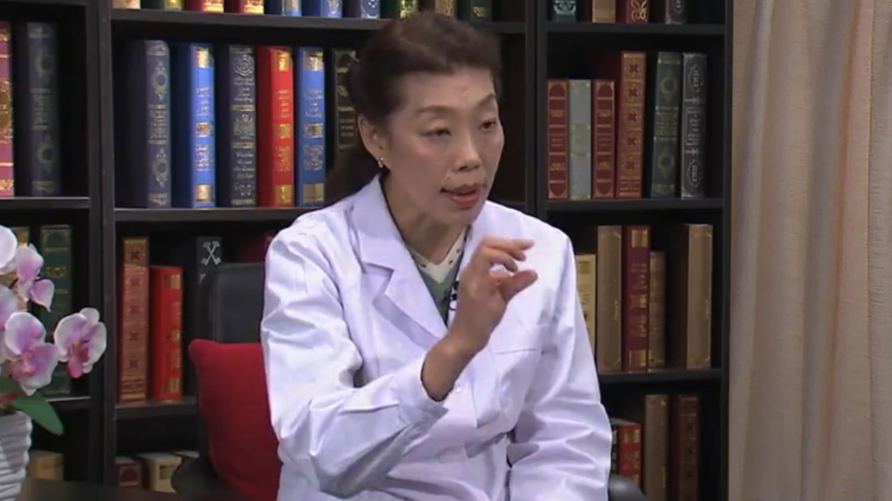

# 12.21 急性牙髓炎

---

## 岳林 主任医师

北京大学口腔医院牙体牙髓科 教授 主任医师 博士生导师。

国家执业医师资格考试口腔类别命审题专家委员会主任委员；中华口腔医学会秘书长、常务理事，牙体牙髓病学专业委员会副主任委员；中华预防医学会健康传播分会委员；北京市口腔医疗质量控制与管理委员会委员；国际牙医学院（ICD）院士。

**主要成就：** 北京市科学技术奖二等奖（2000年，2002年）；中华医学科技奖三等奖（2002年）；教育部科技进步奖一等奖（2009年）；主编北京大学长学制教材《牙体牙髓病学》；主编《国家执业医师资格考试实践技能应试指南》；主编《国家执业医师资格考试综合笔试应试指南》；主译《牙髓外科实用教程》；参编著作20余部，发表论文70余篇。

**专业特长：** 擅长龋病、牙发育性疾病、急慢性牙损伤、牙髓病、根尖周病、牙周牙髓联合病变等牙体牙髓疾病的诊治，尤其擅长对该领域疑难疾病的诊治，包括多发龋、猛性龋的序列治疗，牙痛的鉴别诊断，根管治疗中阻塞根管和顽固感染根管的处理。

---
