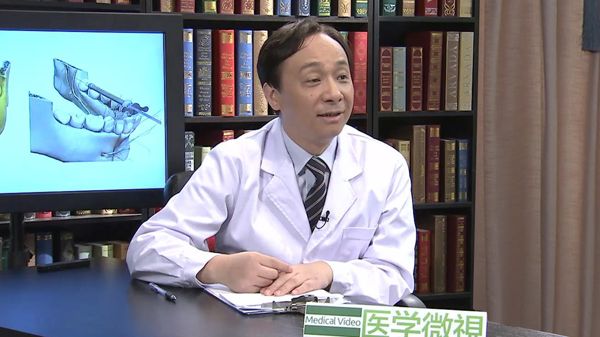

# 12.22 看牙时的局部麻醉

---

## 余东升 主任医师

中山大学附属口腔医院急诊综合科主任兼院感科科长 主任医师 博士生导师 教授。

中华医学会广东省医院感染管理专业委员会委员；中华口腔医学会口腔急诊专业委员会常委；中华口腔医学会口腔病理专业委员会委员；中国抗癌协会广东省头颈外科专业委员委员；广东省口腔医学会老年口腔专业委员会副主任委员；《中华口腔医学研究杂志》编委。

**主要成就：** 主持国家自然科学基金项目3项，参与3项；主持广东省自然科学基金项目3项；主持广东省科技攻关项目5项；已发表科研论文70余篇，其中SCI收录18篇；参编专著3部。

**专业特长：** 从事口腔临床工作20余年，擅长各种口腔急症处置、微创拔牙、牙种植及颌骨囊性病变微创治疗等。

---
