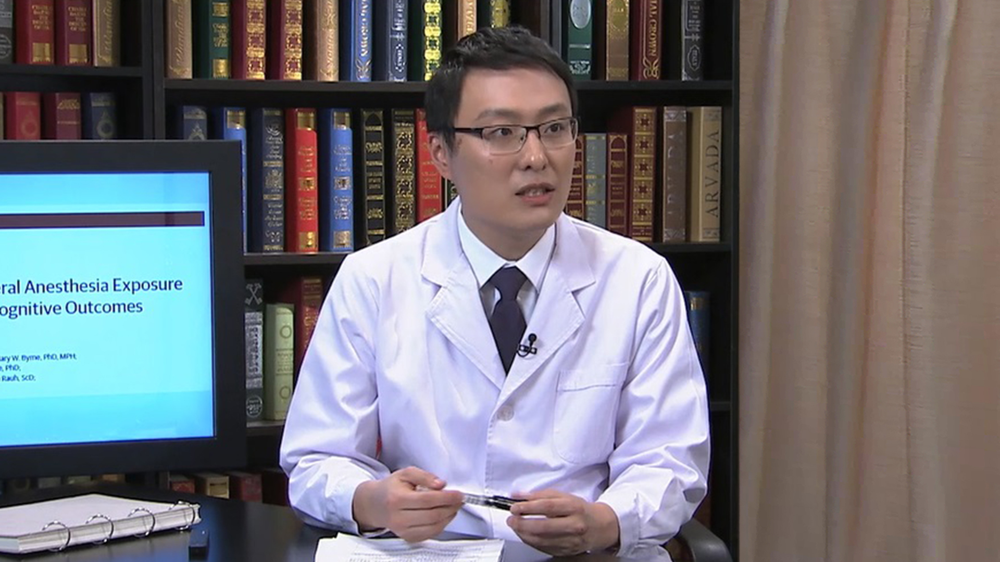

# 12.23 看牙时的全身麻醉

---

## 郁葱主任医师

重庆医科大学附属口腔医院麻醉科兼舒适牙科主任 副主任医师 医学博士 硕士生导师。

中华医学会麻醉学分会手术室外麻醉学组成员；中华口腔医学会口腔镇静镇痛专委会副主任委员；中国心胸血管麻醉学会围术期基础与转化医学分会委员；重庆医师协会麻醉医师分会委员；重庆市医学会麻醉学专委会委员。

**主要成就：** 承担多项重庆市科委、重庆市卫生计生委科研课题；参与制定卫生部《全身麻醉及镇静下儿童牙齿治疗技术管理》专业标准；发表科研论文20余篇，SCI收录6篇，主编著作1部，参编著作2部。

**专业擅长：** 探索出一整套适合各类人群、口腔各专业及整形美容门诊无痛治疗解决方案，在儿童与成人口腔门诊镇静镇痛治疗和伴随合并症的评估方面具备丰富的理论知识和临床经验。

---
