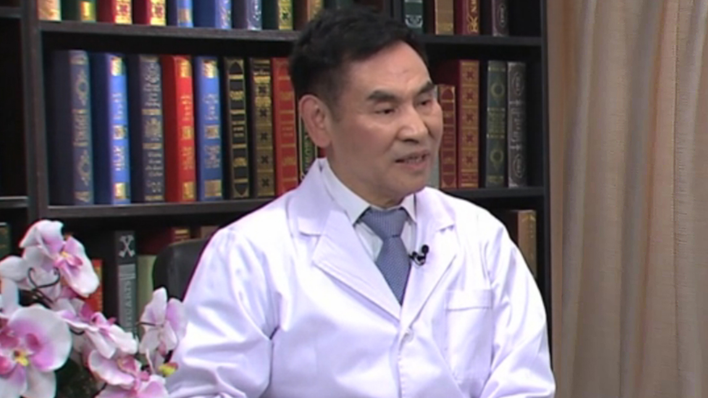

# 12.26 口腔癌

---

## 俞光岩 主任医师

北京大学口腔医学院口腔颌面外科教授 博士生导师。

中华口腔医学会会长；中国医师协会副会长；亚洲口腔颌面外科医师协会前任主席；Chinese Journal of Dental Research主编。

**主要成就：** 以第一完成人获国家科技进步二等奖1项，省部级科技一等奖3项；获“全国卫生系统先进工作者”、“全国五一劳动奖章获得者”及“全国优秀科技工作者”称号；香港牙医师学院、英国爱丁堡皇家外科医师学院和英国英格兰皇家外科医师学院先后授予“Honorary Fellowship”；主编教材及专著16部；培养研究生和博士后70余名；先后承担国家及省部级科研基金项目40项；发表论文450余篇，其中SCI收录150余篇。

**专业特长：** 主要研究方向为唾液腺疾病、口腔颌面部肿瘤以及唾液腺移植治疗重症干眼症。

---
