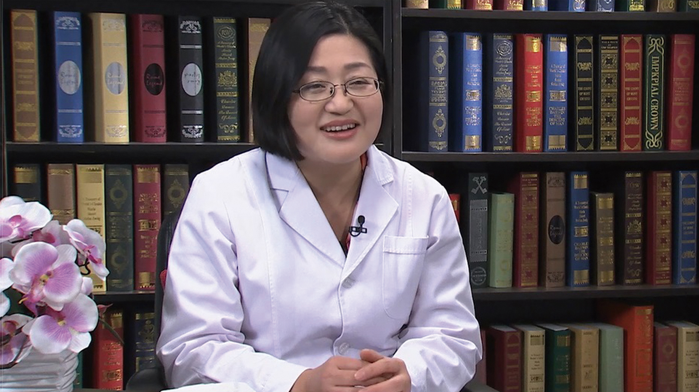

# 12.28 口腔的日常保健

---

## 荣文笙 主任医师

北京大学口腔医院预防科主任医师 口腔医学博士 研究生导师。

中华口腔医学会口腔预防专委会副主任委员；中华预防医学会口腔卫生保健专委会秘书长；中国牙病防治基金会常务副秘书长；中国科协口腔健康首席科学传播专家；世界牙科联盟公共卫生委员；世界公共卫生协会联盟口腔健康委员会委员。

**主要成就：** 主持国内外科研项目15项；组织、设计的口腔健康科普活动多次获得北京市、中国科协优秀科普活动等奖项；发表学术论文30余篇，参编专业论著和教材8本；主编《孕妇婴幼儿口腔健康指导》《牙好，生活更美好》《口腔疾病和口腔保健知识问答》等科普书籍。

**专业特长：** 擅长儿童和成人龋病的风险评估，龋病和牙周病的综合防治，个性化的口腔卫生指导和自我口腔健康的维护。

---
