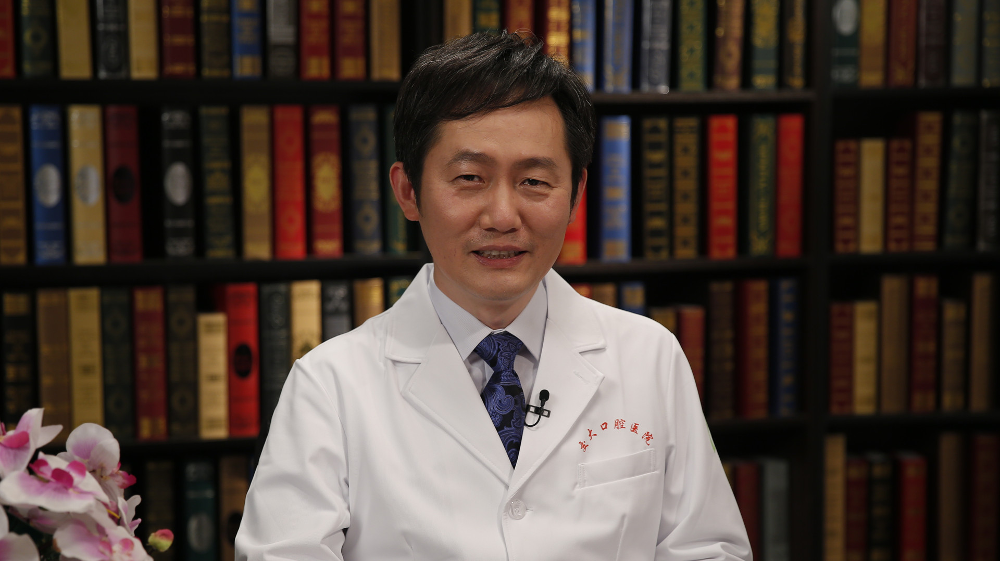

# 12.35 老年人口腔的日常保健

---

## 侯铁舟 主任医师

西安交通大学口腔医院副院长 主任医师 博士生导师。

陕西省口腔质控中心副主任 ；中华口腔医学会牙体牙髓病学专业委员会常委；陕西省口腔医学会牙体牙髓病学专业委员会主任委员；陕西省口腔医学会理事；西安医学会口腔医学分会副主任委员；国际牙医师学院中国区院士。

**主要成就：** 发表论文40余篇；获得国家卫生部科技进步奖一项；获国家发明专利一项；国家、省市级科研项目十余项。

**专业特长：** 致力龋病病因及预防、氟牙症、牙齿发育、牙体硬组织疾病研究，擅长口腔内科疾病的诊断、治疗、预防，各年龄组个体口腔预防保健指导，擅长牙体牙髓疾病的治疗，在牙体牙髓疑难病治疗方面经验丰富。

---
