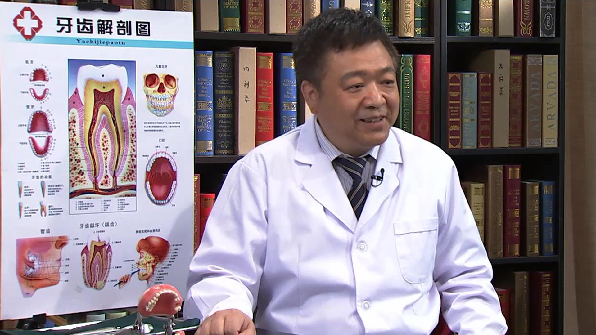

# 12.39 微创拔牙

---

## 胡开进 主任医师

第四军医大学口腔医院口腔外科主任 主任医师 博士生导师.

中华口腔医学会牙槽外科学组组长；中华口腔医学会颞下颌关节病学及牙合学专业委员会委员；中华口腔医学会颞下颌关节病学组委员；中华口腔医学会镇静镇痛专家组成员；国家自然科学基金及国家科技奖评审专家；全国光学会激光医学专委会委员；国际牙医学院院士。

**主要成就：** 参加全国口腔医学８年制统编教材和全国高等院校研究生统编教材的编写工作；已发表教学和科研论文200多篇，其中30余篇文章现已在美国、德国、英国、丹麦、苏格兰等国际顶尖专业杂志上发表；已出版专著34部，其中主编及主译专著16部，参编专著18部；获国家、军队、省部和院校级基金、课题17项，获国家、军队、省部级教学及科研奖励23项。

**专业特长：** 主要从事颞下颌关节疾病及口腔外科疾患的临床、教学和科研工作。所提倡的口腔外科操作“四化理念”受邀在国内外进行100余场学术讲座，并受到广泛好评。

---
