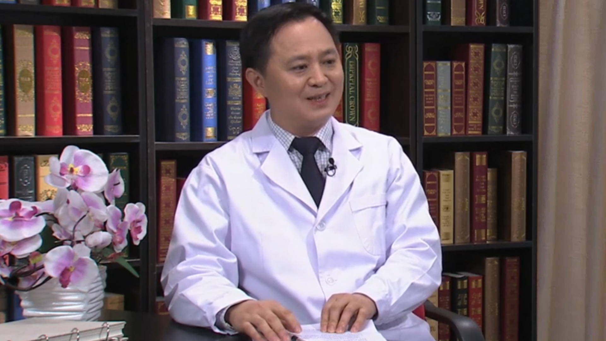

# 12.42 牙齿美容修复

---

## 陈吉华 主任医师

空军军医大学（第四军医大学）口腔医院院长 主任医师 博士生导师。

口腔疾病国家临床医学中心主任；美国佐治亚瑞金大学客座教授；教育部“长江学者”特聘教授；教育部“创新团队”牵头人；中华口腔医学会副会长；全军口腔医学专业委员会主任委员；中华口腔医学会修复专业委员会候任主任委员。

**主要成就：** 科研重点为牙科陶瓷材料、牙科高分子材料、口腔粘接技术的研究，主持包括国科金重点项目、重大国际合作项目在内的各种科研项目10余项；近五年通讯作者发表SCI论文近70篇，主编、副主编专著8部；担任5部国际学术期刊的副主编及编委；相关研究成果获批专利7项，获得陕西省科技进步一等奖，军队医疗成果二等奖。

**专业特长：** 擅长于各类牙齿缺损、缺失疾病的诊治，包括各种固定修复、活动修复的设计与治疗，尤其在美学修复方面有深入的研究。

---
