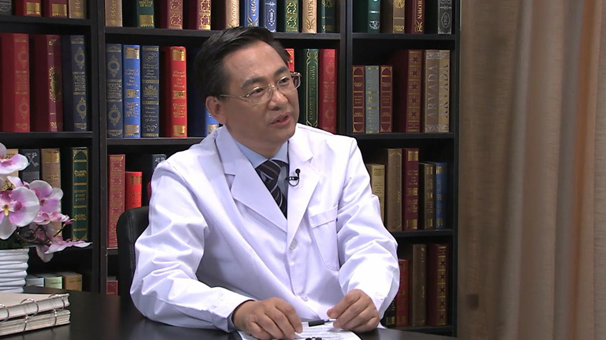

# 12.43 牙齿正畸//王林教授

---

## 王林 主任医师

南京医科大学副校长 博士生导师 主任医师。

南京医科大学附属口腔医院正畸科高级专家；中华口腔医学会副会长；中国医师协会口腔医师分会副会长；江苏省口腔医学会会长；国务院政府特殊津贴获得者；国际牙医学院（FICD）院士。

**主要成就：** 承担国家自然科学基金重点项目等各类课题20余项；获江苏省科技进步二等奖等各类成果19项；曾获“全国优秀医院院长”称号 ；主编专著4部，发表专业论文近200篇，其中包括Nature Communications（IF=11.47）等SCI收录论文50余篇。

**专业特长：** 对复杂牙颌畸形的诊治有独到的建树，率先开展了Twin Block、Hass、自锁托槽矫治技术、隐形矫治技术、舌侧矫治技术和微型种植支抗等技术，并在国内推广使用。

---
