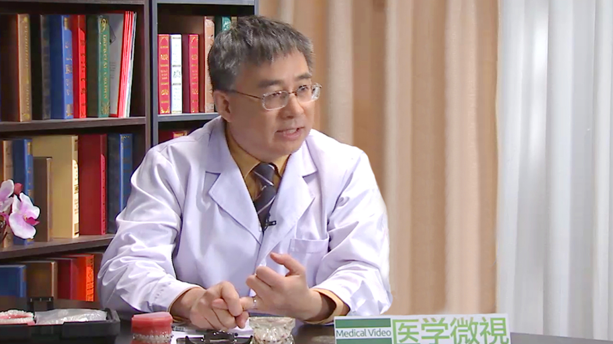

# 12.44 牙齿正畸//周彦恒教授

---

## 周彦恒 主任医师

北京大学口腔医院正畸科原科主任 主任医师 博士生导师。

北京大学口腔干细胞研究与再生中心主任；世界正畸联盟（WFO）执委会执委；中华口腔医学会正畸专业委员会主任委员；中国医疗与美容协会口腔美容分会副主任委员；北京口腔医学会口腔正畸专业委员会副主任委员；口腔数字化医疗技术和材料国家工程实验室第一届技术委员会委员；国际牙医学院（FICD）院士；国际牙科研究会（IADR）会员；亚洲太平洋正畸协会（APOS）执委；欧洲正畸学会（EOS）会员；美国矫正学会（ACA）会员；《中华口腔医学杂志》、《中华口腔正畸学杂志》、《中国实用口腔科杂志》、《华西口腔医学杂志》、《北京口腔医学》、《临床口腔医学》等口腔专业杂志编委；国际SCI期刊《Plos ONE》、《Oral Disease》、《The Angle Orthodontists》审稿人。

**主要成就：** 近5年共主持国家级与省部级科研项目9项，经费总额超过了1100万元；获省、部级科技进步奖励2项，获省部级奖项8项；发明专利、实用新型专利各一项； 至今共发表中英文论文161篇，其中英文SCI文章35篇；作为第一作者和通讯作者在生物材料、干细胞、口腔医学以及正畸学等领域的国际顶级杂志《Immunity》《Advanced Functional Materials》《Cell Research》《Journal of Dental Research》《American journal of Orthodontics & Dentofacial Orthpedics》发表论文28篇，总计影响因子达到了140；此外，参编著作和教材12部；教育部《口腔正畸学》最早国家级精品课程的负责人、教育部资源共享课《口腔正畸学》课程负责人；在国内首先提出了正颌术前术后正畸系统治疗的规范、正畸联合牙周系统治疗牙周病新理念及微螺钉种植体支抗的系统规范。

**专业特长：** 擅长儿童与成人的综合正畸治疗；牙周病和颞颌关节病的正畸治疗；严重骨性错合畸形正颌外科的术前术后正畸治疗；种植体支抗的临床综合研究； 种植前、修复前正畸治疗；个体化舌侧隐形矫治；无托槽隐形矫治等。

---
