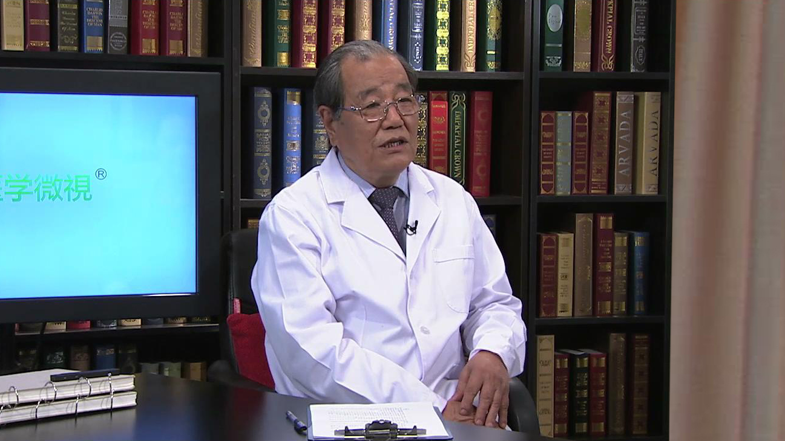

# 12.45 牙颌面畸形

---

## 王兴 主任医师

北京大学口腔医学院颌面外科主任医师 博士生导师。

中华口腔医学会名誉会长；中华医学会名誉理事；中国医师协会副会长；中国科学技术协会九届荣誉委员；国际牙科研究会会员；国际牙医师学院院士；《中华口腔医学杂志》名誉总编。

**主要成就：** 1992年获国家教委、国务院学位办授予的“做出突出贡献的中国博士学位获得者”称号；2001年获首届中华医学科技奖一等奖；2001年所负责的课题“内置式颌骨牵引成骨的临床和实验研究”被评为“九五”期间我国重大科技进展项目；2008年获中华医学会中华系列杂志优秀主编奖；2010年获中华医学科技二等奖；2014获中华口腔医学会科技奖一等奖；2016年获邱蔚六口腔颌面外科发展基金“华佗奖”；先后主编专著11部，参编22部，在国内外学术期刊发表学术论文228篇。

**专业特长：** 擅长种植外科、正颌外科、创伤外科。

---
