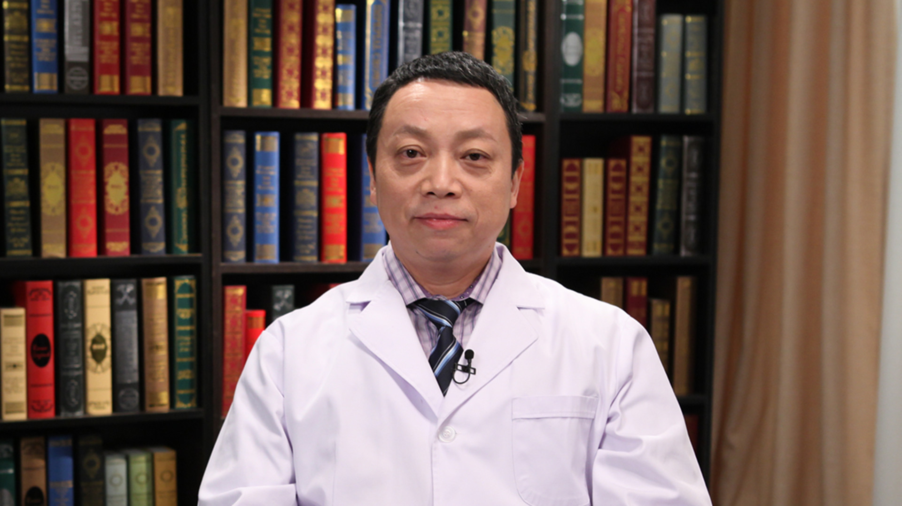

# 12.46 牙体缺损修复（补牙）

---

## 余擎 主任医师

空军军医大学第三附属医院牙体牙髓病科主任 主任医师 博士生导师。

国际牙医师学院中国区院士；中华口腔医学会牙体牙髓病学专业委员会候任主任委员；陕西省口腔医学会牙体牙髓病学专业委员会前任主任委员；陕西省口腔医学会理事；《牙体牙髓牙周病学杂志》副主编。

**主要成就：** “根管治疗新技术基础和应用研究”荣获陕西省科学技术一等奖，“活性氧在牙髓尖周病中的作用及临床应用”荣获陕西省科学技术二等奖；获得国家发明专利3项，实用新型专利7项；主编《牙科临床规范化操作图谱》等5部专著，参编第四、五版全国本科生统编教材《牙体牙髓病学》等6部专著；发表学术论文190余篇，其中SCI收录英文文章36篇,第一或通讯作者的SCI论文23篇。

**专业特长：** 长期从事牙髓组织再生、难治性根尖周病的致病机理和防治策略等方向的体内外研究。擅长疑难牙体牙髓病的诊治，在牙体缺损修复、微创牙髓治疗、显微根管治疗、激光治疗及椅旁CAD/CAM嵌体修复技术方面积累了丰富的临床经验。

---
