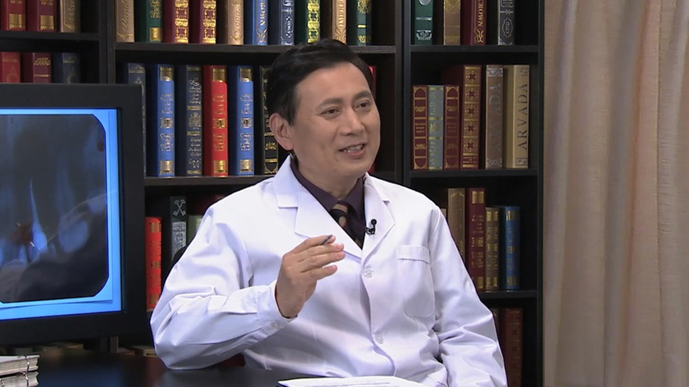

# 12.47 牙体牙髓显微根管治疗

---

## 侯本祥 主任医师

首都医科大学附属北京口腔医院牙体牙髓科主任 主任医师 博士生导师。

中华口腔医学会副秘书长；中华口腔医学会牙体牙髓病学专委会常委；北京口腔医学会牙体牙髓病学专委会主任委员；中华口腔医学会口腔美学专委会常委；《中华口腔医学杂志》编委。

**主要成就：**近十年来获得国家自然科学基金、北京市自然科 学基金等科研项目17项，发表论文110余篇。主编专 著1部，主译专著2部，参编本科生、研究生统编教材 3部。获国家发明专利1项，实用新型专利3项。第二 届“中国医师奖”获得者。第六届“首都十大健康卫士”。

**专业特长：**擅长牙体牙髓疑难病例的诊断和治疗。尤其对根管治疗失败患牙的再治疗、根管内折断器械的取出、显微根尖外科手术等有丰富的临床经验,在显微根管治疗领域有较深的研究和造诣。

---
