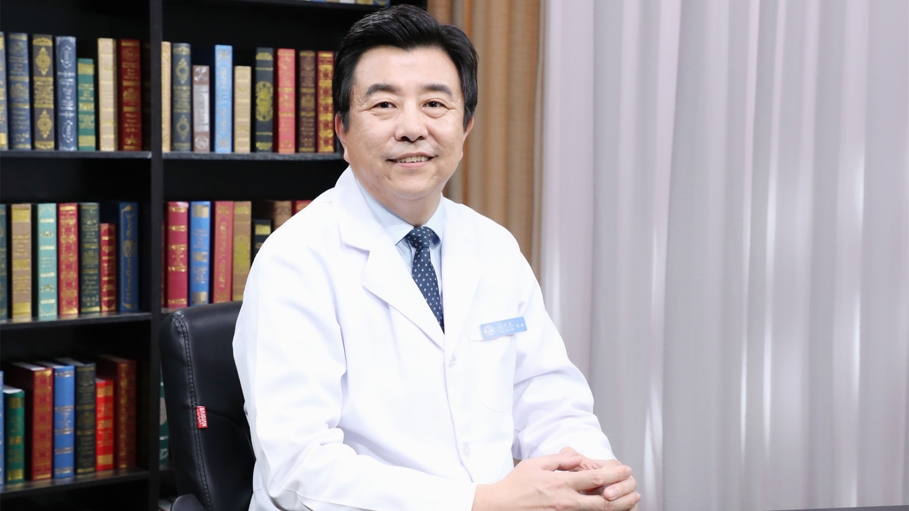

# 12.49 牙龈黑三角（牙龈退缩）

---

## 栾庆先 主任医师

北京大学口腔医院牙周科主任 主任医师 医学博士 博士生导师。

中央保健委员会保健专家 牙周专业特色专家；中国医师协会全民健康促进活动专家委员；中华口腔医学会牙周病学专业委员会常务委员；北京口腔医学会牙周病学专业委员会副主任委员；中国整形美容协会牙颌颜面医疗美容分会副会长。

**主要成就：** 发表SCI论文20余篇；承担国家自然基金、首都医学发展科研基金（重点项目、联合攻关项目）、教育部归国人员启动基金等多项课题；国家卫健委“十三五”规划教材、全国高等学校研究生规划教材《牙周病学》（第2版）副主编；《国际牙科研究杂志》（Journal of Dental Research）编委。

**专业擅长：** 从事牙周病诊疗工作30年，擅长牙周疑难病的诊治，牙周疾病的系统治疗和多学科治疗，种植体周炎的治疗；主要研究方向是：侵袭型牙周炎易感性，干细胞与牙周组织再生，牙周炎与全身系统疾病的关系。

---
