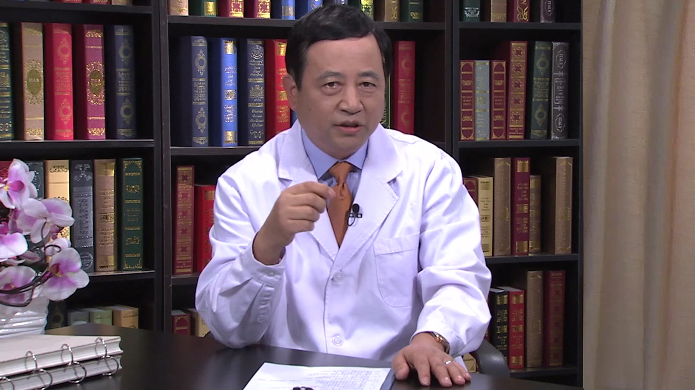

# 12.50 牙龈下刮治

---

## 章锦才 主任医师

中国科学院大学存济医学院副院长 主任医师 博士生导师。

中华口腔医学会副会长；中华口腔医学会牙周病学专委会前任主委；《中华口腔医学杂志》副主编。

**主要成就：** 1996年入选国家教委跨世纪优秀人才；1998年享受国务院政府特殊津贴；1998年获四川省科技进步二等奖；1999年获教育部科技进步三等奖；2001年获国家级教学成果一等奖；2014年获中华口腔医学会科技成果奖二等奖；承担国家及省部级科研课题20余项；主编、参编著作七部，在国内外学术刊物上发表论文200余篇。

**专业特长：** 从事牙周病病因与防治、牙周病与全身健康关系的研究三十余年。

---
