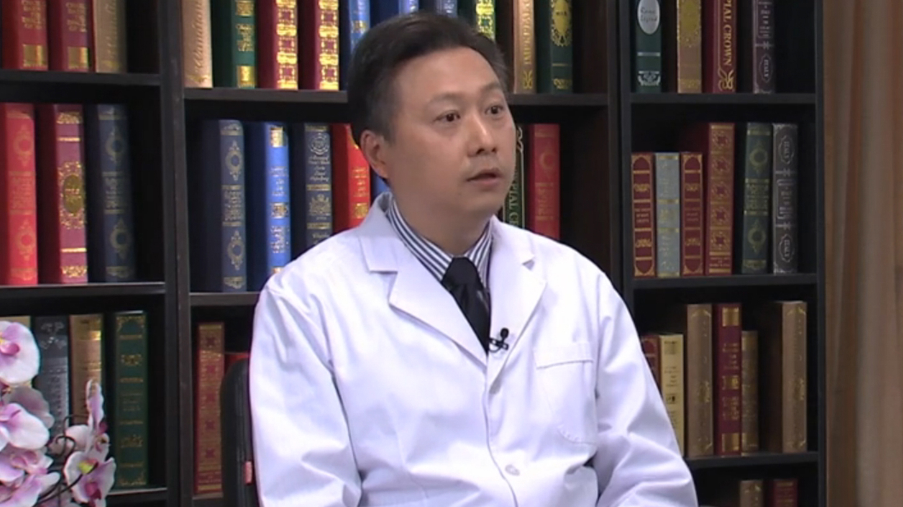

# 12.51 牙周病//王勤涛教授

---

## 王勤涛 主任医师

空军军医大学附属口腔医院牙周科主任医师 医学博士 博士生导师。

中华口腔医学会牙周病学专业委员会主任委员；中华医学科技奖评审专家；军队院校育才银奖获得者；《牙体牙髓牙周病学杂志》副主编。

**主要成就：** 主持完成国家级课题6项，省部级课题3项，发表学术论文170余篇（SCI收录30余篇）；培养博士、硕士研究生48名；主编出版著作、教材4部，参编出版7部；《中华口腔医学杂志》《华西口腔医学杂志》《实用口腔医学杂志》《中国实用口腔科杂志》《中国口腔医学年鉴》等编委。

**专业特长：** 致力于牙周病诊断、组织修复、牙周病与系统健康相关性等领域研究。在牙周病与口腔黏膜病医疗、教学、科研工作方面有33年的从业经历和丰富经验。擅长于牙周病的临床诊断、治疗设计、缺损组织再生、美学修复等。

---
