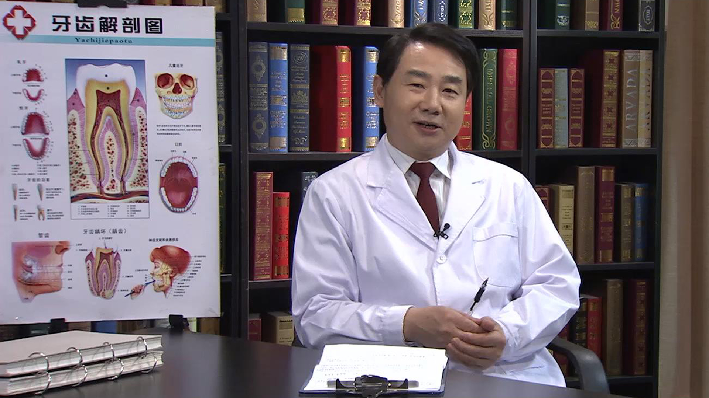

# 12.54 智齿

---

## 赵吉宏 主任医师

武汉大学口腔医院口腔外科主任 口腔颌面外科学教研室副主任 主任医师 研究生导师。

中华口腔医学会外科专委会牙槽外科学组副组长；中华口腔医学会外科专委会脉管病变学组副组长；中华口腔医学会外科专委会修复重建学组委员；中国整形美容学会口腔整形美容分会副会长；中国医师协会头颈外科专委会修复重建学组副组长；湖北省口腔医学会常务理事；湖北省口腔颌面外科专业委员会常务委员

**主要成就：** 主持或参与包括国家自然科学基金及省部级支助的科研项目10余项；获得国家级科技进步二等奖1项，省部级科技进步一等奖1项，省部级科技进步三等奖3项；主编著作2部，副主编著作1部，参编参译著作10部；在国内外相关学术期刊上发表学术论文50余篇；

**专业特长：** 擅长口腔颌面部血管瘤及血管畸形的综合治疗，口腔外科疾病的个性化治疗，口腔颌面部肿瘤的根治及肿瘤术后组织缺损的修复等。

---
